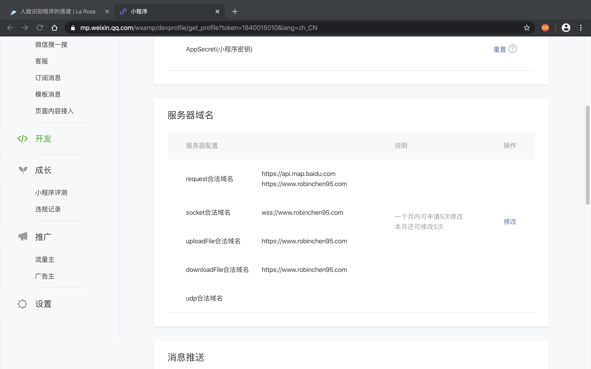
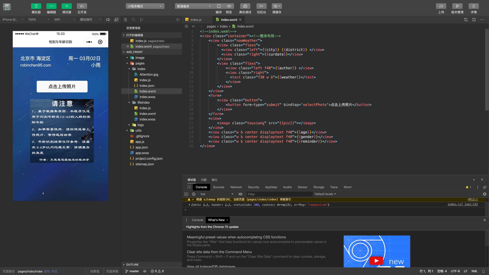

## 一、实现效果  

(感谢吴彦祖同学提供的测试照)  
  

+ 根据后台监测，直到目前，总计有超过一万人次使用过本服务，一直到第一版开发完成一年之后的现在仍然有用户在使用  
+ 本项目从未进行过宣传，仅在朋友圈发过一次链接，万余人次都是用户自发扩散的，表明本项目趣味性尚可  
+ 基于保护隐私的目的，请勿保存用户上传的照片，请尊重个人隐私  

## 二、项目结构  

  

## 三、准备工作  
### (1)微信小程序申请  
> **[微信小程序的申请及开发工具的使用](https://robinchen95.com/documents/wx02.pdf)**  

### (2)购买具有公网IP的云主机，阿里云、腾讯云、新浪云等等均可  
做第一版架构时，由于没有备案过的域名，所以此项目曾经有过这样的架构版本：  
由于微信小程序只能添加备案过的域名作为request请求域，不可以直接使用公网IP，所以，需要做一次请求转发，目的是绕过腾讯域名审核。 
而只有新浪云会提供带有备案域名的服务器，为了绕过域名备案，第一版架构购买了一个新浪云服务器。但由于新浪云只提供基于PHP语言环境的服务器，
无法提供AI程序运行所需要的Python环境，导致该服务器只能作为中转站使用，又购买了一个阿里云服务器跑模型，所以第一版的小程序的最终架构为：  
`发送`：微信→新浪云服务器图片中转→阿里云服务器图片解析得到结果  
`接收`：阿里云服务器图片解析结果→新浪云结果返回→微信   
  
```python
'''
具体步骤
'''
a.微信小程序使用微信提供的接口，向新浪云发送图片并请求返回数据  
b.新浪云服务器使用PHP接收封装的HTTPS请求，存储图片到本地，并同时自己封装一个HTTPS请求，将图片的url传递给阿里云服务器，阻塞并请求返回数据  
c.阿里云服务器监听5002(也可以是其他自定义的)端口，接到HTTPS请求，得到新浪云服务器传递过来的URL地址
d.阿里云服务器使用该地址从新浪云下载图片到本地，再使用Python提交到我们自己训练好的AI模型处理，返回结果  
e.新浪云服务器接收到阿里云服务器的处理结果，将结果传回到微信小程序，微信小程序接到返回的数据之后，使用返回的结果更新界面  
```
注意：如果你没有备案过的域名，那就只能购买新浪云服务器做中转，因为其自带新浪云的二级备案域名，目的是绕过腾讯域名审核。

新浪云的PHP转发代码如下：
```php
<?php
header('Content-Type:application/json');  //此声明非常重要
//----------------------------------------------------------------  
// 本节处理微信端上传图片，上传成功保存则到本地，失败则返回失败消息
if(is_uploaded_file($_FILES['file']['tmp_name'])) {
    //把文件转存到目录
    $uploaded_file=$_FILES['file']['tmp_name'];
    $username =  "min_img";
    //给每个用户动态的创建一个文件夹
    $user_path="./weixin/";
    //判断该用户文件夹是否已经有这个文件夹
    if(!file_exists($user_path)) {
        mkdir($user_path);
        echo $user_path;
    }
    $file_true_name=$_FILES['file']['name'];
    // 这是新浪云提供的本机域名
    $base_name = 'http://1.e2321.sc2yun.com';
    $user_overwrite_path="/weixin";
    $random_pre_name = "/".time().rand(1,1000)."-".date("Y-m-d").substr($file_true_name,strrpos($file_true_name,"."));
    $file_name_combined = $base_name."".$user_overwrite_path."".$random_pre_name;
    $move_to_file=$user_path."/".$random_pre_name;
    $age = 25;
    $gender = 'Male';
 	if(move_uploaded_file($uploaded_file,$move_to_file)) {
        $tempFile= $move_to_file;
        $post_data = array('pic'=>$file_name_combined);
        //此处应该将IP改为目标机器的IP
        $return_data = send_post('http://47.75.137.198:5002/employees',json_encode($post_data));
        $info['age'] = $age;
        $info['gender']= $gender;
        echo json_encode($info);
    } else {
        echo "上传失败1".date("Y-m-d H:i:sa");
    }
} else {
    echo "上传失败2".date("Y-m-d H:i:sa");
}
//----------------------------------------------------------------  

// 本节为发送http请求的函数
function send_post($url, $post_data) {
	$postdata = http_build_query($post_data);
	$options = array(
		'http' => array(
			'method' => 'POST',
			'header' => 'Content-type:application/json',
			'content' => $postdata,
			'timeout' => 15 * 60 // 超时时间（单位:s）
		)
	);
	$context = stream_context_create($options);
	$result = file_get_contents($url, false, $context);
	return $result;
}
?>
```
### (3)为域名部署https证书  
> **[阿里云的证书部署](https://www.cnblogs.com/SemiconductorKING/p/9106971.html)**  
> 此处应该注意的是，https监听的是443端口，而http监听的是80端口，所以针对http请求需要配置一下转发，会在接下来的Nginx配置中介绍  
> 比如访问[http://robinchen95.com](http://robinchen95.com),会自动转发到https监听的443端口  

## 四、微信前端  
### (1)前端分析  
**1. 为什么前端会用微信小程序呢？**  
    a.因为微信小程序是实现`跨平台`的最好方法，可以同时兼容安卓、iOS、桌面操作系统，一言蔽之，只要能装微信的地方，都可以运行  
    b.为了使程序具有趣味性，需要用户能够实时上传照片或拍照，那么最好该设备能具有摄像头，那么最好的载体自然是手机，能够随时随地使用而不受限制  
    
**2. 微信前端开发中需要使用的工具与语言**  
    a.首先需要下载微信开发者工具[微信开发者工具](https://developers.weixin.qq.com/miniprogram/dev/devtools/download.html)  
    b.与一般的前端开发相同，需要使用HTML(WXML)、CSS(WXSS)、JS进行开发，同时，微信开发工具里集成了很多API，部分功能都不需要自己实现  
    
**3. 微信前端需要实现的功能分析**  
    a.无论后端架构如何改变，微信前端的任务是：`获取图片，发送图片，接收结果`。至于后端使用了几个服务器，如何做了存证，架构怎样，前端一概不关心。
    b.获取图片：从用户的角度而言，需要有两种获取图片的方式：实时拍照上传与上传相册照片
    c.发送图片：获取到图片之后，向目标URL发送一次https请求，并请求回复
    d.接受结果：前端接收到返回的结果后，将数据经过解析展现在屏幕上  
    
**4. 微信开发配置**  
    a.配置安全域：在微信公众平台中登录已经申请过的微信小程序，在开发-开发设置-服务器域名中设置服务器的配置，只有经过这一步之后，小程序才能使用腾讯之外的URL
      
    
**5. 微信版本管理**  
    a.微信小程序必须经过腾讯审核才能发布，在微信开发工具中写好的小程序需要上传，然后再微信公众平台通过审核之后发布才能对用户开放  

### (2)前端代码解析    
   
经过上述分析，前端代码的任务是：获取图片，发送图片，接收结果，那么依据此思路进行设计：
对于位置与天气信息的更新涉及到百度API与开发者账号的申请，此处略去不表，可以将此处换成其他信息，需要展示的数据都是可以自定义的，
包括图片与文字内容，比如对于位置天气等信息，是先前端使用占位符，等待js请求的数据获取到之后进行更新，图片同理。  

**1. 获取图片的设计要点**    
```html
<!--关键代码-->
<view class="container">
    <view class="nowWeather">
        <view class="flexs">
          <!-- 对位置与天气信息进行展位，等待JS实时更新-->
          <view class="left">{{city}} {{district}} </view>
          <view class="right">{{curdate}}</view>
        </view>
        <view class="flexs">
            <view class="left f40">{{author}} </view>
            <view class="right">
              <text class="f30 w b">{{weather}}</text>
            </view>
        </view>
    </view>
    <form>
        <view class="button">
            <!-- 按钮信息，bindtap='selectPhoto'指的是点击时执行对应的js文件中的selectPhoto函数-->
            <button form-type="submit" bindtap='selectPhoto'>点击上传照片</button>
        </view>
    </form>
    <view>
        <!-- 对图片同样是先进行占位，等待用户拍照或者选择照片之后更新-->
        <image class="touxiang" src="{{pic}}"></image>
    </view>
    <!-- 服务器解析之后的年龄与性别信息-->
    <view class="w b center displaytext f40">{{age}}</view>
    <view class="w b center displaytext f40">{{gender}}</view>
    <view class="w b center displaytext f40">{{reminder}}</view>
</view>
```

**2. 发送图片与接收结果的设计要点**  
发送图片主要涉及用户拍照与选择相册上传、向服务器上传用户上传的图片  
```javascript
// 解决用户拍照与选择相册上传
 selectPhoto:function(){
    var that = this;
    // 询问用户是拍照还是从相册选择照片
    wx.showActionSheet({
      itemList: ['从相册中选择', '拍照'],
      itemColor: "#39C5BB",
      success: function (res) {
        if (!res.cancel) {
          if (res.tapIndex == 0) {
            that.chooseWxImage('album')
          } else if (res.tapIndex == 1) {
            that.chooseWxImage('camera')
          }
        }
      }
    })
  }
```
接收结果主要是上传成功之后的回调函数，对于用户上传的恶作剧图片(不包含人脸的图片)，识别结果"-1"并输出图片错误结果；对于正常图片，则解析后展示      
```javascript
    // 用户做完选择之后，向服务器上传照片
 chooseWxImage: function (type) {
    var that = this;
    var id = '001';
    // 注意，此处只能使用在微信公众平台配置的安全域URL
    var url = "https://www.robinchen95.com/upload";
    wx.chooseImage({
      sizeType: ['original', 'compressed'],
      sourceType: [type],
      success: function (res) {
        console.log(res);
        // 用户上传完图片之后到接收到服务器相应之前，设置响应内容  
        that.setData({
          tempFilePaths:res.tempFilePaths,
          age: "请稍候（>﹏<）",
          gender: "正在提交服务器判断",

        }) 
        //-----上传图片-----
        wx.uploadFile({
          url: url,
          filePath: res.tempFilePaths[0],
          name: 'file',
          // 上传成功的回调函数
          success: function (res) {
            console.log(res.data);
            // 经过多数用户使用之后，发现部分用户会上传恶作剧图片或者不合格的图片，此时识别后端返回的"-1"
            if (res.data=="-1"){
              that.setData({
                age:  " 请提交人脸图片！",
                gender:  "请不要恶作剧！（╯‵□′）╯︵┴─┴",
              })
            } 
            // 对于识别正常的用户，展示结果，此时返回的结果是一个自定义的字符串，解析后进行展示  
            else{
              var res_gender = res.data.split('"')[5];
              if (res_gender == "Male") {res_gender="男";}
              if (res_gender == "Female") {res_gender = "女";}
              that.setData({
                age: "经AI推测，您的年龄是：" + res.data.split(':')[1].split(',')[0],
                gender: "经AI推测，您的性别是：" + res_gender, 
                reminder:"测试误差在±5岁以内哦o(*￣︶￣*)o",
              })
            }
          }
        })
      // 此处是用户上传完照片之后，将图片更改为用户选择的图片
      var imgPath = res.tempFilePaths[0];
      that.setData({
        pic:imgPath,
      })
      }
    })
  }
```


## 五、后端服务  

## 六、AI实现  

## 七、性能优化  

## 八、项目测试  

