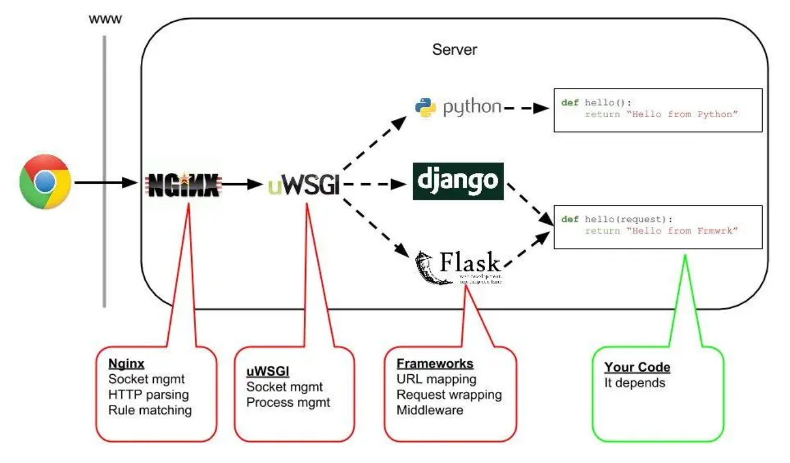
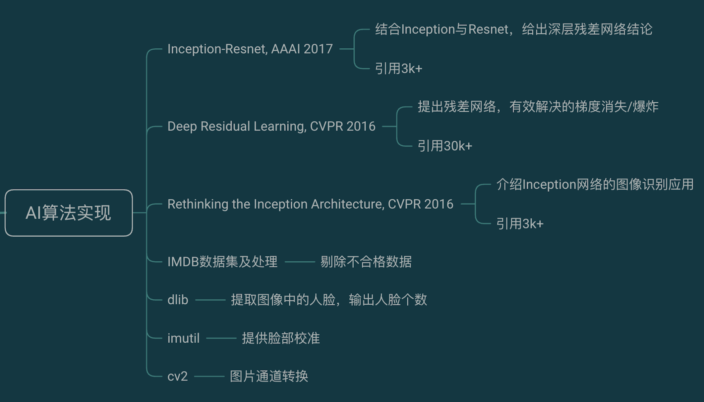
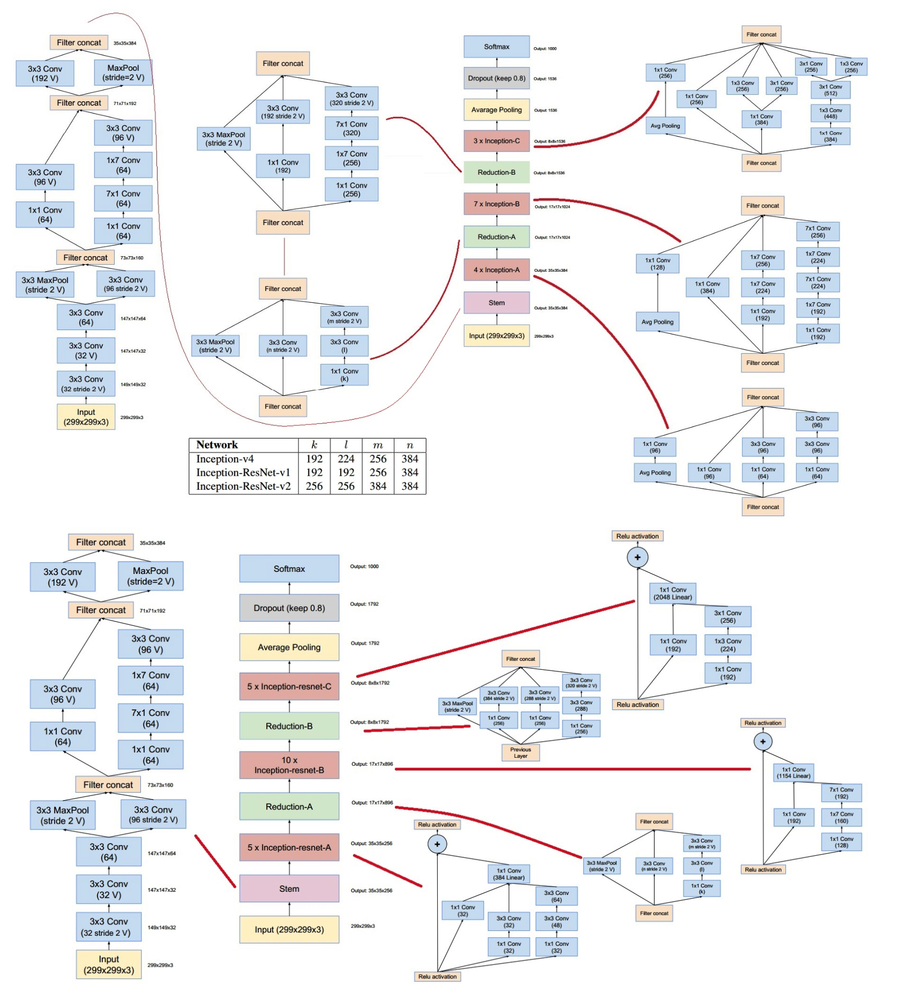

## 一、实现效果  

(感谢吴彦祖同学提供的测试照)  
  

+ 根据后台监测，直到目前，总计有超过一万人次使用过本服务，一直到第一版开发完成一年之后的现在仍然有用户在使用  
+ 本项目从未进行过宣传，仅在朋友圈发过一次链接，万余人次都是用户自发扩散的，表明本项目趣味性尚可  
+ 基于保护隐私的目的，请勿保存用户上传的照片，请尊重个人隐私  

## 二、项目结构  

  

## 三、准备工作  
### 「1」 微信小程序申请  
> **[微信小程序的申请及开发工具的使用](https://robinchen95.com/documents/wx02.pdf)**  

### 「2」 购买具有公网IP的云主机  
做第一版架构时，由于没有备案过的域名，所以此项目曾经有过这样的架构版本：  
由于微信小程序只能添加备案过的域名作为request请求域，不可以直接使用公网IP，所以，需要做一次请求转发，目的是绕过腾讯域名审核。 
而只有新浪云会提供带有备案域名的服务器，为了绕过域名备案，第一版架构购买了一个新浪云服务器。但由于新浪云只提供基于PHP语言环境的服务器，
无法提供AI程序运行所需要的Python环境，导致该服务器只能作为中转站使用，又购买了一个阿里云服务器跑模型，所以第一版的小程序的最终架构为：  
`发送`：微信→新浪云服务器图片中转→阿里云服务器图片解析得到结果  
`接收`：阿里云服务器图片解析结果→新浪云结果返回→微信   
  
```python
'''
具体步骤
'''
a.微信小程序使用微信提供的接口，向新浪云发送图片并请求返回数据  
b.新浪云服务器使用PHP接收封装的HTTPS请求，存储图片到本地，并同时自己封装一个HTTPS请求，将图片的url传递给阿里云服务器，阻塞并请求返回数据  
c.阿里云服务器监听5002(也可以是其他自定义的)端口，接到HTTPS请求，得到新浪云服务器传递过来的URL地址
d.阿里云服务器使用该地址从新浪云下载图片到本地，再使用Python提交到我们自己训练好的AI模型处理，返回结果  
e.新浪云服务器接收到阿里云服务器的处理结果，将结果传回到微信小程序，微信小程序接到返回的数据之后，使用返回的结果更新界面  
```
注意：如果你没有备案过的域名，那就只能购买新浪云服务器做中转，因为其自带新浪云的二级备案域名，目的是绕过腾讯域名审核。

新浪云的PHP转发代码如下：
```php
<?php
header('Content-Type:application/json');  //此声明非常重要
//----------------------------------------------------------------  
// 本节处理微信端上传图片，上传成功保存则到本地，失败则返回失败消息
if(is_uploaded_file($_FILES['file']['tmp_name'])) {
    //把文件转存到目录
    $uploaded_file=$_FILES['file']['tmp_name'];
    $username =  "min_img";
    //给每个用户动态的创建一个文件夹
    $user_path="./weixin/";
    //判断该用户文件夹是否已经有这个文件夹
    if(!file_exists($user_path)) {
        mkdir($user_path);
        echo $user_path;
    }
    $file_true_name=$_FILES['file']['name'];
    // 这是新浪云提供的本机域名
    $base_name = 'http://1.e2321.sc2yun.com';
    $user_overwrite_path="/weixin";
    $random_pre_name = "/".time().rand(1,1000)."-".date("Y-m-d").substr($file_true_name,strrpos($file_true_name,"."));
    $file_name_combined = $base_name."".$user_overwrite_path."".$random_pre_name;
    $move_to_file=$user_path."/".$random_pre_name;
    $age = 25;
    $gender = 'Male';
 	if(move_uploaded_file($uploaded_file,$move_to_file)) {
        $tempFile= $move_to_file;
        $post_data = array('pic'=>$file_name_combined);
        //此处应该将IP改为目标机器的IP
        $return_data = send_post('http://47.75.137.198:5002/employees',json_encode($post_data));
        $info['age'] = $age;
        $info['gender']= $gender;
        echo json_encode($info);
    } else {
        echo "上传失败1".date("Y-m-d H:i:sa");
    }
} else {
    echo "上传失败2".date("Y-m-d H:i:sa");
}
//----------------------------------------------------------------  

// 本节为发送http请求的函数
function send_post($url, $post_data) {
	$postdata = http_build_query($post_data);
	$options = array(
		'http' => array(
			'method' => 'POST',
			'header' => 'Content-type:application/json',
			'content' => $postdata,
			'timeout' => 15 * 60 // 超时时间（单位:s）
		)
	);
	$context = stream_context_create($options);
	$result = file_get_contents($url, false, $context);
	return $result;
}
?>
```
### 「3」 为域名部署https证书  
> **[阿里云的证书部署](https://www.cnblogs.com/SemiconductorKING/p/9106971.html)**  
> 此处应该注意的是，https监听的是443端口，而http监听的是80端口，所以针对http请求需要配置一下转发，会在接下来的Nginx配置中介绍  
> 比如访问[http://robinchen95.com](http://robinchen95.com),会自动转发到https监听的443端口  

## 四、微信前端  
### 「1」 前端分析  
**1. 为什么前端会用微信小程序呢？**  
    a.因为微信小程序是实现`跨平台`的最好方法，可以同时兼容安卓、iOS、桌面操作系统，一言蔽之，只要能装微信的地方，都可以运行  
    b.为了使程序具有趣味性，需要用户能够实时上传照片或拍照，那么最好该设备能具有摄像头，那么最好的载体自然是手机，能够随时随地使用而不受限制  
    
**2. 微信前端开发中需要使用的工具与语言**  
    a.首先需要下载微信开发者工具[微信开发者工具](https://developers.weixin.qq.com/miniprogram/dev/devtools/download.html)  
    b.与一般的前端开发相同，需要使用HTML(WXML)、CSS(WXSS)、JS进行开发，同时，微信开发工具里集成了很多API，部分功能都不需要自己实现  
    
**3. 微信前端需要实现的功能分析**  
    a.无论后端架构如何改变，微信前端的任务是：`获取图片，发送图片，接收结果`。至于后端使用了几个服务器，如何做了存证，架构怎样，前端一概不关心。  
    b.获取图片：从用户的角度而言，需要有两种获取图片的方式：实时拍照上传与上传相册照片  
    c.发送图片：获取到图片之后，向目标URL发送一次https请求，并请求回复  
    d.接受结果：前端接收到返回的结果后，将数据经过解析展现在屏幕上  
    
**4. 微信开发配置**  
    a.配置安全域：在微信公众平台中登录已经申请过的微信小程序，在开发-开发设置-服务器域名中设置服务器的配置，只有经过这一步之后，小程序才能使用腾讯之外的URL  
      
    
**5. 微信版本管理**  
    a.微信小程序必须经过腾讯审核才能发布，在微信开发工具中写好的小程序需要上传，然后再微信公众平台通过审核之后发布才能对用户开放  

### 「2」 前端代码解析    
   
经过上述分析，前端代码的任务是：获取图片，发送图片，接收结果，那么依据此思路进行设计：
对于位置与天气信息的更新涉及到百度API与开发者账号的申请，此处略去不表，可以将此处换成其他信息，需要展示的数据都是可以自定义的，
包括图片与文字内容，比如对于位置天气等信息，是先前端使用占位符，等待js请求的数据获取到之后进行更新，图片同理。  

**1. 获取图片的设计要点**    
```html
<!--关键代码-->
<view class="container">
    <view class="nowWeather">
        <view class="flexs">
          <!-- 对位置与天气信息进行展位，等待JS实时更新-->
          <view class="left">{{city}} {{district}} </view>
          <view class="right">{{curdate}}</view>
        </view>
        <view class="flexs">
            <view class="left f40">{{author}} </view>
            <view class="right">
              <text class="f30 w b">{{weather}}</text>
            </view>
        </view>
    </view>
    <form>
        <view class="button">
            <!-- 按钮信息，bindtap='selectPhoto'指的是点击时执行对应的js文件中的selectPhoto函数-->
            <button form-type="submit" bindtap='selectPhoto'>点击上传照片</button>
        </view>
    </form>
    <view>
        <!-- 对图片同样是先进行占位，等待用户拍照或者选择照片之后更新-->
        <image class="touxiang" src="{{pic}}"></image>
    </view>
    <!-- 服务器解析之后的年龄与性别信息-->
    <view class="w b center displaytext f40">{{age}}</view>
    <view class="w b center displaytext f40">{{gender}}</view>
    <view class="w b center displaytext f40">{{reminder}}</view>
</view>
```

**2. 发送图片与接收结果的设计要点**  
发送图片主要涉及用户拍照与选择相册上传、向服务器上传用户上传的图片  
```javascript
// 解决用户拍照与选择相册上传
 selectPhoto:function(){
    var that = this;
    // 询问用户是拍照还是从相册选择照片
    wx.showActionSheet({
      itemList: ['从相册中选择', '拍照'],
      itemColor: "#39C5BB",
      success: function (res) {
        if (!res.cancel) {
          if (res.tapIndex == 0) {
            that.chooseWxImage('album')
          } else if (res.tapIndex == 1) {
            that.chooseWxImage('camera')
          }
        }
      }
    })
  }
```
接收结果主要是上传成功之后的回调函数，对于用户上传的恶作剧图片(不包含人脸的图片)，识别结果"-1"并输出图片错误结果；对于正常图片，则解析后展示  
    
```javascript
    // 用户做完选择之后，向服务器上传照片
 chooseWxImage: function (type) {
    var that = this;
    var id = '001';
    // 注意，此处只能使用在微信公众平台配置的安全域URL
    var url = "https://www.robinchen95.com/upload";
    wx.chooseImage({
      sizeType: ['original', 'compressed'],
      sourceType: [type],
      success: function (res) {
        console.log(res);
        // 用户上传完图片之后到接收到服务器相应之前，设置响应内容  
        that.setData({
          tempFilePaths:res.tempFilePaths,
          age: "请稍候（>﹏<）",
          gender: "正在提交服务器判断",

        }) 
        //-----上传图片-----
        wx.uploadFile({
          url: url,
          filePath: res.tempFilePaths[0],
          name: 'file',
          // 上传成功的回调函数
          success: function (res) {
            console.log(res.data);
            // 经过多数用户使用之后，发现部分用户会上传恶作剧图片或者不合格的图片，此时识别后端返回的"-1"
            if (res.data=="-1"){
              that.setData({
                age:  " 请提交人脸图片！",
                gender:  "请不要恶作剧！（╯‵□′）╯︵┴─┴",
              })
            } 
            // 对于识别正常的用户，展示结果，此时返回的结果是一个自定义的字符串，解析后进行展示  
            else{
              var res_gender = res.data.split('"')[5];
              if (res_gender == "Male") {res_gender="男";}
              if (res_gender == "Female") {res_gender = "女";}
              that.setData({
                age: "经AI推测，您的年龄是：" + res.data.split(':')[1].split(',')[0],
                gender: "经AI推测，您的性别是：" + res_gender, 
                reminder:"测试误差在±5岁以内哦o(*￣︶￣*)o",
              })
            }
          }
        })
      // 此处是用户上传完照片之后，将图片更改为用户选择的图片
      var imgPath = res.tempFilePaths[0];
      that.setData({
        pic:imgPath,
      })
      }
    })
  }
```


## 五、后端服务  
### 「1」 后端分析  
后端采用Nginx + uWSGI + flask + supervisord 实现
后端需要实现：通过URL实现用户上传文件、将文件传入AI模型解析、返回AI模型解析的结果  
|框架|作用|
|:----:|:----:|
|Nginx|一个开源的Web服务器，用于接收请求，起到反向代理的作用|
|uWSGI|用于在Nginx与Flask应用之间通信|
|Flask|一个Python的轻量级Web框架，用于定义一个网络服务，用于解析内容|
|supervisord|一个守护进程，能够让某个进程即使关闭SSH窗口也能一直在后台运行|
整体架构：  
  

### 「2」 关键代码解析  

**1. Nginx配置解析**  
Nginx是主Web服务器，同时提供了[本网站主页](https://robinchen95.com/)与文件上传的分发功能  
Nginx的配置可参考：[在linux上通过nginx配置微信小程序服务器](https://www.jianshu.com/p/95f617564de5)  
Nginx也需要同时配置upload module用于上传文件，参考文章[Nginx上传模块](https://www.cnblogs.com/lidabo/p/4169721.html)  
Nginx建议使用编译安装，方便后续配置添加模块  
Nginx.conf详解：  
```python
# 启用一个工作线程，与CPU线程数有关
worker_processes  1;

# Nginx的事件模块
events {
    # 同时允许1024个连接
    worker_connections  1024;
}

# Nginx的http模块，在其中用server{ ... }添加指定server，可以添加多个server
http {
    include       mime.types;
    client_max_body_size 100M;
    default_type  application/octet-stream;
    sendfile        on;
    keepalive_timeout  65;

    # 添加的一个server，用于监听http的80端口，将http强制转换为https
    server {
        listen       80;
        server_name  robinchen95.com;
        # 强制http转到https
     return 301 https://$host$request_uri;
    }
        
    # 添加的第二个server，同样也是用server{ ... }添加指定server
    # 本处的server写的是监听https的443端口
    # location用于识别域名后的uri，例如location /upload{ ... }用于监听到https://robinchen95.com/upload 时服务器的行为
    server {
         listen 443 ssl;
         charset utf-8;
         client_max_body_size 100M;
         server_name robinchen95.com;
         ssl_certificate   cert/2017351_www.robinchen95.com.pem;
         ssl_certificate_key  cert/2017351_www.robinchen95.com.key;
         ssl_session_timeout 5m;
         ssl_ciphers ECDHE-RSA-AES128-GCM-SHA256:ECDHE:ECDH:AES:HIGH:!NULL:!aNULL:!MD5:!ADH:!RC4;
         ssl_protocols TLSv1 TLSv1.1 TLSv1.2;
         ssl_prefer_server_ciphers on;
    
         # 配置博客主页访问
         location / {
             root /myblog/src/.vuepress/dist;
             index index.html index.htm;
         }
    
        # 配置图片上传
        # 需要在此处配置uWSGI的参数
        location /upload {
            include uwsgi_params;         # 导入uwsgi配置                                            
            uwsgi_pass  127.0.0.1:8081;    # 转发端口，需要和uwsgi配置当中的监听端口一致                                             
            uwsgi_param UWSGI_PYHOME /root/env/;       # Python解释器所在的路径（这里为虚拟环境）      
            uwsgi_param UWSGI_CHDIR /root/env;             # 项目根目录     
            uwsgi_param UWSGI_SCRIPT test:app; #（比如你测试用test.py文件，文件中app = Flask(__name__)，那么这里就填  test：app)
            #return 200 "success";
        }
        
        # 配置document文件夹的访问，输入https://robinchen95.com/documents 即可访问
        location /documents{
            root    /;
            autoindex on;
        }
      }	
}

```

**2. uWSGI配置解析**  
uWSGI起到的作用是连接Nginx与flask进程，将Nginx转发的请求发给flask解析并向Nginx返回结果  
uWSGI的安装配置教程[Python uWSGI 安装配置](https://www.runoob.com/python3/python-uwsgi.html)  
uWSGI的配置文件：  
```python
[uwsgi]
# 由于外部还要嵌套Nginx，这里可以使用socket进行通信，如果Nginx和uwsgi部署在同一台机器上，直接使用127.0.0.1
# 如果外部直接通过uwsgi访问服务，需将socket改为http-socket或者http，将127.0.0.1改为0.0.0.0
socket = 127.0.0.1:8081
# 这行一定要加上，不然请求时会出现-- unavailable modifier requested: 0 --错误提示 
plugins = python   
# 项目目录                                               
chdir = /root/env
# 虚拟环境所在路径
virtualenv =/root/env
# 编写flask代码的py文件
wsgi-file = test.py
# Flask应用对象
callable = app
```

**3. Flask配置解析**  
Flask相当于是一个时刻都在运行的python服务，使得python应用可以通过指定的端口访问到  
Flask基础教程[Flask官方文档](https://dormousehole.readthedocs.io/en/latest/)  
test.py文件解析：

```python
# coding=utf-8
import os
import sys
sys.path.append("/root/env")
import app_wx
from flask import Flask, request
# 加密上传的文件，可以去掉 
from werkzeug import secure_filename   
app = Flask(__name__)
# 在此处加载AI模型，这个很重要，可以减少很多重复加载时间
model_cv = app_wx.Application("./models")

@app.route('/upload', methods=['GET','POST'])
def upload_img():
    if request.method == 'GET':   # 如果是 GET 请求方式
        return "请不要通过浏览器访问！来自python2.7"
    if request.method == 'POST':   # 如果是 POST 请求方式
        file = request.files['file']   # 获取上传的文件
    if file:
        # 获取加密后的文件名
        filename = secure_filename(file.filename)   
        file.save(os.path.join('/img', '{}'.format(filename)))
        # 调用加载好的模型预测
        pre_result=model_cv.predict(os.path.join('/img', '{}'.format(filename)))
        # 预测成功
        return pre_result   
    return "failed"

if __name__ == "__main__":
    app.run(host='0.0.0.0', port=8081)

```

**4. supervisord配置解析**  
supervisord是一个守护进程，用于守护uWSGI进程，让其能够一直在后台运行，而不是因为断开SSH连接而停止  
supervisord教程：[supervisord守护进程的使用](https://www.cnblogs.com/lemon-flm/articles/9283664.html)  
supervisord配置文件解析：  
```python
; supervisor config file

[unix_http_server]
file=/var/run/supervisor.sock   ; (the path to the socket file)
chmod=0700                       ; sockef file mode (default 0700)

[supervisord]
logfile=/var/log/supervisor/supervisord.log ; (main log file;default $CWD/supervisord.log)
pidfile=/var/run/supervisord.pid ; (supervisord pidfile;default supervisord.pid)
childlogdir=/var/log/supervisor            ; ('AUTO' child log dir, default $TEMP)

supervisor.rpcinterface_factory = supervisor.rpcinterface:make_main_rpcinterface

[supervisorctl]
serverurl=unix:///var/run/supervisor.sock ; use a unix:// URL  for a unix socket
; 主要是配置在此之下的内容
[include]
files = /etc/supervisor/conf.d/*.conf

[program:uwsgi]
; 配置命令，指定uwsgi运行
command= /usr/local/bin/uwsgi --ini /root/uwsgi.ini
user=root
autostart=true
autorestart=true
```

## 六、AI实现  
### 「1」AI分析
  

**1. 关于AI算法与数据集的选择**  
> 由于CV方向的迭代速度相当快，经常上月发布的最新算法就已经过时被替代，所以在算法的选择方面只需要选择近几年的顶会论文即可，没有过于苛求新网络
、新算法。所以本次选择的是2017年发布与AAAI的Inception-Resnet，同时，参考了两篇CVPR 2016的论文，链接如下：  
+ [介绍Inception-Resnet，结合Inception与Resnet，给出深度残差网络的结论，AAAI 2017](https://robinchen95.com/documents/InceptionV4.pdf)  
+ [介绍残差网络在深度学习中的应用，用以解决深层神经网络的梯度消失/爆炸的问题，CVPR 2016](https://robinchen95.com/documents/He_Deep_Residual_Learning_CVPR_2016_paper.pdf)  
+ [介绍Inception网络在图像识别领域中的应用，CVPR 2016](https://robinchen95.com/documents/Rethinking_the_Inception_CVPR_2016_paper.pdf)  
+ Inception-Resnet结构:

  
> 同时，由于是学生，拿不到商业公司的数据集，所以就用的是开源的IMDB数据集，总计两百多G，但由于机器性能限制，本次跑的是精简版数据集   

+ [数据集下载地址](https://data.vision.ee.ethz.ch/cvl/rrothe/imdb-wiki/ )  


|数据集类型|图片总数|
|:----:|:----:|
|训练集|305004|
|测试集|16053|
|总计|321057|

**2. AI模型环境**  
> 硬件环境  

|硬件|训练环境|使用环境|
|:----:|:----:|:----:|
|CPU|8核16线程 |1核1线程|
|GPU|RTX 2060s 8G|无|
|RAM|64G DDR4|2GB|

> 软件环境

|软件|训练环境|使用环境|
|:----:|:----:|:----:|
|操作系统|windows 10|Ubuntu 16.04LTS|
|虚拟环境|Anaconda|flask虚拟环境|
|Python版本|Python2.7|Python2.7|

**3. 实现结果分析**  
|项目|准确率|
|:----:|:----:|
|年龄|±4.54岁|
|性别|81.69%|

### 「2」关键代码解析  
**1. 关于数据集处理**  
|处理方式|使用的库|
|:----:|:----:|
|脸部校正与识别|dlib|
|剔除不合格数据|自己写的逻辑|
|图片预处理与转换|CV2|

**2. 关键代码解析**  
[年龄与性别检测AI代码解析](https://robinchen95.com/documents/AGE.pdf)

