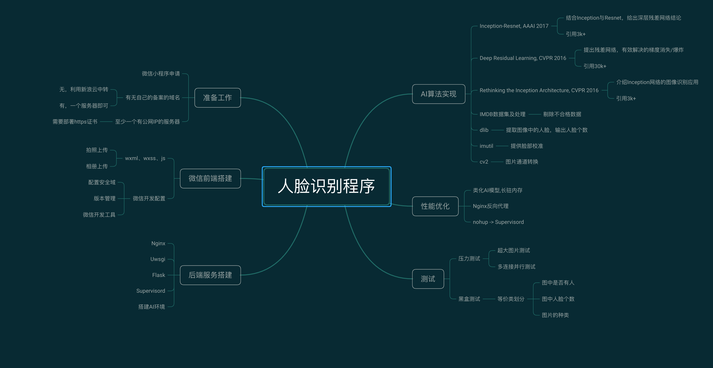

## 实现效果  

(感谢吴彦祖同学提供的测试照)  
  

## 项目结构  

  

## 准备工作  
1.微信小程序申请  
> **[微信小程序的申请及开发工具的使用](https://robinchen95.com/documents/wx02.pdf)**  

2.购买具有公网IP的云主机，阿里云、腾讯云、新浪云等等均可。  
此项目曾经有过两个架构版本：  
**当没有备案域名时**  
由于微信小程序智能添加备案过的域名作为request请求域，不可以直接使用公网IP，所以，需要用PHP做一次请求转发，将图片保存在新浪云服务器。 
只有新浪云会提供带有备案域名的服务器，为了绕过域名备案，第一版架构购买了一个新浪云服务器。但由于新浪云只提供基于PHP语言环境的服务器，
无法提供AI程序运行所需要的Python环境，导致该服务器只能作为中转站使用，所以第一版的小程序的最终架构为：  
`发送`：微信→新浪云服务器图片中转→阿里云服务器图片解析得到结果  
`接收`：阿里云服务器图片解析结果→新浪云结果返回→微信   
  
```python
'''
具体步骤
'''
a.微信小程序使用微信提供的接口，向新浪云发送图片并请求返回数据  
b.新浪云服务器使用PHP接收封装的HTTP请求，存储图片到本地，并同时自己封装一个http请求，将图片的url传递给阿里云服务器，阻塞并请求返回数据  
c.阿里云服务器监听5002(也可以是其他自定义的)端口，接到HTTP请求，得到传递的url地址
d.阿里云服务器使用该地址从新浪云下载图片到本地，再使用Python提交到我们自己训练好的AI模型处理，返回结果  
e.新浪云服务器接收到阿里云服务器的处理结果，将结果传回到微信小程序，微信小程序接到返回的数据之后，使用返回的结果更新界面  
```
注意：如果没有备案过的域名，那就只能购买新浪云服务器作数据中转，因为其自带新浪云的二级备案域名，目的是绕过腾讯域名审核。

新浪云的PHP转发代码如下：
```php
<?php
header('Content-Type:application/json');  //此声明非常重要
//----------------------------------------------------------------  
// 本节处理微信端上传图片，上传成功保存则到本地，失败则返回失败消息
if(is_uploaded_file($_FILES['file']['tmp_name'])) {
    //把文件转存到目录
    $uploaded_file=$_FILES['file']['tmp_name'];
    $username =  "min_img";
    //给每个用户动态的创建一个文件夹
    $user_path="./weixin/";
    //判断该用户文件夹是否已经有这个文件夹
    if(!file_exists($user_path)) {
        mkdir($user_path);
        echo $user_path;
    }
    $file_true_name=$_FILES['file']['name'];
    // 这是新浪云提供的本机域名
    $base_name = 'http://1.e2321.sc2yun.com';
    $user_overwrite_path="/weixin";
    $random_pre_name = "/".time().rand(1,1000)."-".date("Y-m-d").substr($file_true_name,strrpos($file_true_name,"."));
    $file_name_combined = $base_name."".$user_overwrite_path."".$random_pre_name;
    $move_to_file=$user_path."/".$random_pre_name;
    $age = 25;
    $gender = 'Male';
 	if(move_uploaded_file($uploaded_file,$move_to_file)) {
        $tempFile= $move_to_file;
        $post_data = array('pic'=>$file_name_combined);
        //此处应该将IP改为目标机器的IP
        $return_data = send_post('http://47.75.137.198:5002/employees',json_encode($post_data));
        $info['age'] = $age;
        $info['gender']= $gender;
        echo json_encode($info);
    } else {
        echo "上传失败1".date("Y-m-d H:i:sa");
    }
} else {
    echo "上传失败2".date("Y-m-d H:i:sa");
}
//----------------------------------------------------------------  

// 本节为发送http请求的函数
function send_post($url, $post_data) {
	$postdata = http_build_query($post_data);
	$options = array(
		'http' => array(
			'method' => 'POST',
			'header' => 'Content-type:application/json',
			'content' => $postdata,
			'timeout' => 15 * 60 // 超时时间（单位:s）
		)
	);
	$context = stream_context_create($options);
	$result = file_get_contents($url, false, $context);
	return $result;
}
?>
```
4.为域名部署https证书  
> **[阿里云的证书部署](https://www.cnblogs.com/SemiconductorKING/p/9106971.html)**  
> 此处应该注意的是，https监听的是443端口，而http监听的是80端口，所以针对http请求需要配置一下转发，会在接下来的Nginx配置中介绍  
> 比如访问[http://robinchen95.com](http://robinchen95.com),会自动转发到https监听的443端口  

## 微信前端  
1. 为什么前端会用微信小程序呢？  
    + 因为微信小程序是实现`跨平台`的最好方法，可以同时兼容安卓、iOS、桌面操作系统，一言蔽之，只要能装微信的地方，都可以运行  
    + 为了使程序具有趣味性，需要用户能够实时上传照片或拍照，那么最好该设备能具有摄像头，那么最好的载体自然是手机，能够随时随地使用而不受限制  
2. 微信前端开发中需要使用的工具与语言  
    + 首先需要下载微信开发者工具[微信开发者工具](https://developers.weixin.qq.com/miniprogram/dev/devtools/download.html)  
    + 与一般的前端开发相同，需要使用HTML(WXML)、CSS(WXSS)、JS进行开发，同时，微信开发工具里集成了很多API，许多功能都不需要自己实现  
3. 微信前端的功能分析  

    


## 后端服务  

## AI实现  

## 性能优化  

## 项目测试  

