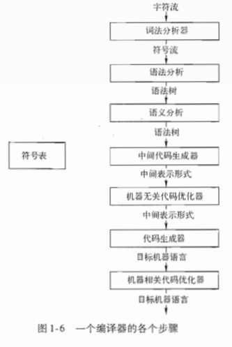
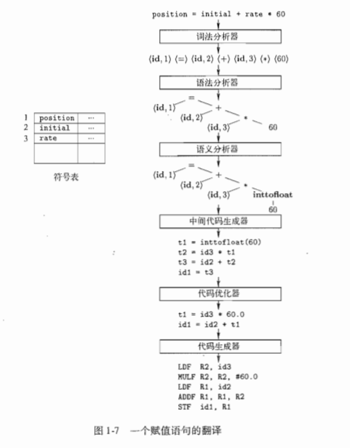
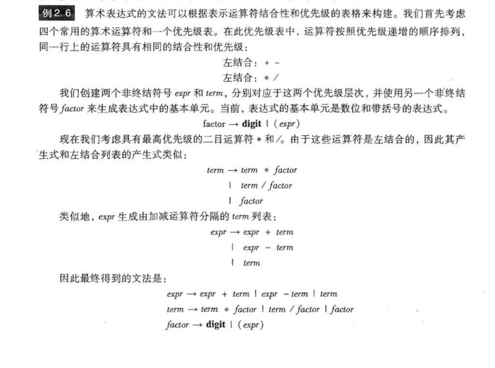

## 关于编译原理  

> 编译一直是计算机软件中一门很重要的核心课，也是本科计算机四大原理里最难的一门课，本文是按照龙书整理  
编译原理主要关注的是将一种计算机语言翻译为另一种计算机语言,其中，`三地址`码是编译原理中一种重要的中间代码，类似于汇编语言  
编译原理主要研究的是`2型文法`，即上下文无关文法，编译原理所涉及的思想，也是自然语言处理的研究方法之一    
本位旨在梳理出一个最基本的编译器的基本结构与实现方法，并阐述清楚以前所做的Java语言C编译器的具体实现内容

## 引论  
+ 编译器：阅读某一种源语言并把该程序翻译为目标语言的程序  
解释器：不翻译语言，直接利用用户提供的输入执行源程序中指定的操作

+ 编译器结构：  
  

---  
**以下为编译前端**

1. 词法分析：  
<span style="color:red">输入</span>：以**词为单位**，词法分析器分析句子中的每个单词，包括分号，等号等  
<span style="color:red">输出</span>：词法单元`<种别码，属性值>`  
例如 position = initial + rate +60  
position被映射成<id, 1>，其中id代表identifier，1代表符号表中id所对应的条目，也可以用position代替  
= 被映射成<=>，不需要第二个分量，因为=是**一词一码**的  
initial被映射成<id, 2>，2代表initial对应符号表的条目  
\+、\*均会被映射为<\+>、<\*>  
空格会被词法分析器忽略  
  

2. 语法分析：  
<span style="color:red">输入</span>：词法分析之后的词法单元流  
<span style="color:red">输出</span>：词法单元流的树形中间表示，即**语法树**  
该树显示了语句中各个运算的执行顺序  

3. 语义分析：  
<span style="color:red">输入</span>：语法分析之后的语法树  
<span style="color:red">输出</span>：检查过语义之后的语法树，具体涉及到类型检查与自动类型转换等  
类型检查：检查每个运算符是否具有匹配的运算分量，例如数组就不能有`array[1.5]`  

4. 中间代码生成：  
<span style="color:red">输入</span>：语义检查完整之后的语法树  
<span style="color:red">输出</span>：三地址码或者其他的中间指令，例如 z = x + y  
三地址指令：每一个指令的右边只能由最多一个运算符，可以没有；编译器应该生成一个临时的名字存放三地址指令计算得到的值  

**以上为编译前端**

---  
**以下为编译后端**

5. 代码优化：  
<span style="color:red">输入</span>：中间代码序列  
<span style="color:red">输出</span>：逻辑等价的优化代码序列  

6. 代码生成：  
<span style="color:red">输入</span>：中间代码序列  
<span style="color:red">输出</span>：目标语言，可以是机器代码，也可以是其他语言，到此，编译完毕  
生成机器代码的时候，需要为之分配内存与寄存器  

7. 符号表管理：  
记录源程序所用变量的名字与该名字的属性等  
记录各种保留字等其他信息  

**以上为编译后端**  
+ 其他：  
编译器的实现需要将多个步骤组合成一趟，每趟读入一个输入文件并产出一个输出文件  
编译器同时也可以将一个机器的二进制代码翻译为另一个机器的二进制代码，例如微软运行在高通处理器上的Windows系统就使用了二进制翻译器  
Java的编译前端都是生成相同的字节码，编译后端使用不同的解释器在不同的目标机器上执行  
类型检查：捕捉程序中的类型不匹配，比如返回值不匹配、传参不匹配，还能检查出更多的例如指针错误  
边界检查：处理数组越界、缓冲溢出等情况  
内存管理：例如Java的GC，而C与C++经常会有内存泄漏  
---  

+ 静态与动态语言的区别  
如果一个语言使用的策略支持编译器静态决定某个问题，那么就称这个语言使用了静态策略，或者这个问题可以在`编译时`确定  
如果一个语言只允许运行程序的时候做出决定，那么就称这个语言使用了动态策略，或者说这个问题需要在`运行时`确定 
 
Java的static关键字：  
例如声明 `public static int x; //static的意思是编译器可以静态确定这个变量的位置`  
这个x就是一个类变量，不管这个类有多少对象，都只有一个x的拷贝；并且，编译器可以静态确定这个变量在内存中的存放位置。  
反之，如果没有static关键字，编译器就只有动态确定这个变量的位置。 
Java把对象的引用当作值传递，这样两个形参指向同一个位置，这样两个变量互称为对方的别名 

C语言的静态策略：  
定义在函数内的变量，作用域被限制在它出现的那个函数内  
在顶层声明的变量x（顶层就是定义在所有函数之外的意思），那么它的作用域就是在声明之后的所有程序。  
如果之后的某个函数中也声明了x，那么该函数的语句就不在顶层x的作用范围内，并且C语言不能在函数内定义另一个函数  


+ 上下文无关文法：所有的产生式左边只有一个非终结符  
上下文有关文法：产生式左边可能有终结符  
 解释：  
``` 
在应用一个产生式进行推导时，前后已经推导出的部分结果就是上下文。  
 上下文无关的意思的，只要文法的定义里有某个产生式，不管一个非终结符前后的串是什么，就可以应用相应的产生式进行推导。  
 （从形式上来看，就是产生式的左边都是单独一个非终结符，即形如 S-> ...，而不是非终结符左右还有别的东西，例如 aSb -> ...）
举例：  
**上下文无关文法的产生式：**：  
    Sent -> S V O  
    S -> 人 | 天  
    V -> 吃 | 下  
    O -> 雨 | 雪 | 饭 | 肉  
其中英文字母都是非终结符（SVO 分别表示主谓宾），汉字都是终结符.  
这个文法可以生成如下句子：｛人吃饭，天下雨，人吃肉，天下雪，人下雪，天下饭，天吃肉，……｝
可以看到，其中有一些搭配在语义上是不恰当的，例如“天吃肉”。  
其（最左）推导过程为：Sent -> SVO -> 天VO -> 天吃O -> 天吃肉但是上下文无关文法里，因为有“V -> 吃 | 下”
这样一条产生式，V 就永远都可以推出“吃”这个词，它并不在乎应用“V -> 吃 | 下”这个产生式进行推导时 V 所在的上下文
（在这个例子里，就是”天VO“中 V 左右两边的字符串”天“和”O“）。
事实上，在 V 推出“吃”这一步，它的左边是“天”这个词，而”天“和”吃“不搭配，导致最后的句子读起来很奇怪。

**上下文有关文法的产生式：**：  
     Sent -> S V 
     OS -> 人 | 天  
     人V -> 人吃
     天V -> 天下
     下O -> 下雨 | 下雪
     吃O -> 吃饭 | 吃肉
 可以看到，这里对 V 的推导过程施加了约束：虽然 V 还是能推出”吃“和”下“两个词，但是仅仅当 V 左边是”人“时，才允许它推导出”吃“；
 而当 V 左边是”天“时，允许它推导出”下“。这样通过上下文的约束，就保证了主谓搭配的一致性。
 类似地，包含 O 的产生式也约束了动宾搭配的一致性。这样一来，这个语言包含的句子就只有｛人吃饭，天下雨，人吃肉，天下雪｝这四条，都是语义上合理的。
 以”人吃饭“为例，推导过程为：Sent -> SVO -> 人VO -> 人吃O -> 人吃饭其中第三步推导是这样的：非终结符 V 的上文是“人”。
 因此可以应用“人V -> 人吃”这条产生式，得到“人VO -> 人吃O”。第四步也类似。
```  

## 语法制导翻译器  

1、首先确定，上下文无关文法是用于组织编译前端的关键。  
上下文无关文法定义：  
+ 终结符集合，是词法单元，终结符号是该文法定义的语言符号集合，空符号记为ε  
+ 非终结符集合，是词法变量，非终结符表示的是一个终结符号串集合  
+ 一个产生式集合，其中，产生式左部`仅有一个非终结符`
+ 指定一个非终结符作为开始符号  

2、语法分析的任务：接受一个终结符号串作为输入，找到从该文法的开始符号推导出这个串的方法，如果不能从文法的开始符号推导得到该终结符号串，那么
就报告该终结符号串中包含语法错误  

3、如果一个文法有多颗语法分析树能够生成同一个终结符号串，那么这个文法就是具有二义性的，要证明一个文法具有二义性，只需要找到一个终结符号串，
说明它是两颗语法分析树的结果即可。  

4、+、-、*、/都是左结合的，而 =、+=、指数运算等都是右结合的，这些符号是属于它左方/右方的符号，他们的分析树都是不同的。  

5、构造具有优先级的文法： 
设计具有n个优先级的文法，就至少需要n+1个非终结符号   
  

6、

## 参考文献  
1. [Compilers:Principles, Techniques & Tools](https://item.jd.com/25755470698.html)  
2. [知乎：应该如何理解「上下文无关文法」？](https://www.zhihu.com/question/21833944)  
3. [自己动手写编译器](https://pandolia.net/tinyc/index.html)