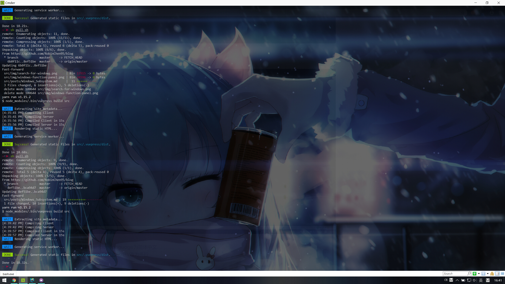

## 更换源为阿里、清华或者网易
更换阿里源：  
```bash
# 打开apt源的文件
# 注意只有vi是linux自带的文本编辑器，部分mini安装的Linux没有vim与nano
sudo vi /etc/apt/sources.list
# 将以下内容覆盖原内容，然后保存退出
deb http://mirrors.aliyun.com/ubuntu/ xenial main
deb-src http://mirrors.aliyun.com/ubuntu/ xenial main

deb http://mirrors.aliyun.com/ubuntu/ xenial-updates main
deb-src http://mirrors.aliyun.com/ubuntu/ xenial-updates main

deb http://mirrors.aliyun.com/ubuntu/ xenial universe
deb-src http://mirrors.aliyun.com/ubuntu/ xenial universe
deb http://mirrors.aliyun.com/ubuntu/ xenial-updates universe
deb-src http://mirrors.aliyun.com/ubuntu/ xenial-updates universe

deb http://mirrors.aliyun.com/ubuntu/ xenial-security main
deb-src http://mirrors.aliyun.com/ubuntu/ xenial-security main
deb http://mirrors.aliyun.com/ubuntu/ xenial-security universe
deb-src http://mirrors.aliyun.com/ubuntu/ xenial-security universe
# 更新源
sudo apt-get update
```
更换清华源：  
```bash
# 打开apt源源的文件
# 注意只有vi是linux自带的文本编辑器，部分mini安装的Linux没有vim与nano
sudo vi /etc/apt/sources.list
# 将以下内容覆盖原内容，然后保存退出
deb https://mirrors.tuna.tsinghua.edu.cn/ubuntu/ xenial main restricted universe multiverse
# deb-src https://mirrors.tuna.tsinghua.edu.cn/ubuntu/ xenial main restricted universe multiverse
deb https://mirrors.tuna.tsinghua.edu.cn/ubuntu/ xenial-updates main restricted universe multiverse
# deb-src https://mirrors.tuna.tsinghua.edu.cn/ubuntu/ xenial-updates main restricted universe multiverse
deb https://mirrors.tuna.tsinghua.edu.cn/ubuntu/ xenial-backports main restricted universe multiverse
# deb-src https://mirrors.tuna.tsinghua.edu.cn/ubuntu/ xenial-backports main restricted universe multiverse
deb https://mirrors.tuna.tsinghua.edu.cn/ubuntu/ xenial-security main restricted universe multiverse
# deb-src https://mirrors.tuna.tsinghua.edu.cn/ubuntu/ xenial-security main restricted universe multiverse
# 更新源
sudo apt-get update
```
更换网易源：  
```bash
# 打开apt源源的文件
# 注意只有vi是linux自带的文本编辑器，部分mini安装的Linux没有vim与nano
sudo vi /etc/apt/sources.list
# 将以下内容覆盖原内容，然后保存退出
deb http://mirrors.163.com/ubuntu/ wily main restricted universe multiverse
deb http://mirrors.163.com/ubuntu/ wily-security main restricted universe multiverse
deb http://mirrors.163.com/ubuntu/ wily-updates main restricted universe multiverse
deb http://mirrors.163.com/ubuntu/ wily-proposed main restricted universe multiverse
deb http://mirrors.163.com/ubuntu/ wily-backports main restricted universe multiverse
deb-src http://mirrors.163.com/ubuntu/ wily main restricted universe multiverse
deb-src http://mirrors.163.com/ubuntu/ wily-security main restricted universe multiverse
deb-src http://mirrors.163.com/ubuntu/ wily-updates main restricted universe multiverse
deb-src http://mirrors.163.com/ubuntu/ wily-proposed main restricted universe multiverse
deb-src http://mirrors.163.com/ubuntu/ wily-backports main restricted universe multiverse
# 更新源
sudo apt-get update
```

## 拷贝文件到服务器与从服务器下载文件  
Linux系统之间拷贝文件可以用scp命令：  
```bash
# 例1：将服务器的pull.sh脚本拷贝到C盘
scp root@101.200.53.152:/myblog/pull.sh /mnt/c
# 例2：将服务器的/myblog脚本拷贝到C盘，加一个-r即可
scp -r root@101.200.53.152:/myblog /mnt/c
# 上传文件就是将scp后的参数倒过来就行
```

## SSH与Git不用输入密码的设置  
### SSH  
在本机上的操作：  
```bash
# 如果没有.ssh文件夹，那么运行命令，直接按三次空格即可
ssh-keygen -t rsa
# 打开ssh文件夹
cd ~/.ssh/
# 将公钥放置到服务器，如果服务器上没有.ssh文件夹，需要先登录服务器进行创建
scp id_rsa.pub username@server:~/.ssh/id_rsa.pub
```
在服务器上的操作：  
```bash
# 登录到服务器，在服务器上输入命令：
cd ~/.ssh
cat id_rsa.pub >> authorized_keys
rm id_rsa.pub
```
---
### Git  
Github也可以按照上述操作，使用ssh的方式  
也可以输入命令：  
```bash
git config --global credential.helper store
```

## Docker相关  
以下以ubuntu 16.04为例安装docker：  
```bash
# 1.选择国内的云服务商，这里选择阿里云为例
curl -sSL http://acs-public-mirror.oss-cn-hangzhou.aliyuncs.com/docker-engine/internet | sh -
# 2.安装所需要的包
sudo apt-get install linux-image-extra-$(uname -r) linux-image-extra-virtual
# 3.添加使用 HTTPS 传输的软件包以及 CA 证书
sudo apt-get update
sudo apt-get install apt-transport-https ca-certificates
# 4.添加GPG密钥
sudo apt-key adv --keyserver hkp://p80.pool.sks-keyservers.net:80 --recv-keys 58118E89F3A912897C070ADBF76221572C52609D
# 5.添加软件源
echo "deb https://apt.dockerproject.org/repo ubuntu-xenial main" | sudo tee /etc/apt/sources.list.d/docker.list
# 6.添加成功后更新软件包缓存
sudo apt-get update
# 7.安装docker
sudo apt-get install docker-engine
# 8.开机启动 docker
sudo systemctl enable docker
sudo systemctl start docker
# 9.测试docker
docker -v
```
使用docker安装32bit/ubuntu镜像（因为实验需要32位环境）：  
```bash
# docker拉取32bit/ubuntu:16.04镜像
docker pull 32bit/ubuntu:16.04
# docker使用容器运行镜像，此时已经可以运行镜像的bash了
docker run -it 32bit/ubuntu:16.04 /bin/bash
# 退出
exit
# 以下是为了每次都进入同一个容器，而不是每次docker run -it都新建
# 查看已运行的容器ID，找到32bit/ubuntu所对应的容器ID，例如0f6d789c5df9
docker ps -a
# 开启容器
docker start [ID]
# 进入容器
docker exec -it [ID] /bin/bash
# 可以使用docker rm + 容器ID来删除多余容器
```
## ZSH相关  
配置效果：  
  
安装Oh-My-Zsh：  
```bash
sh -c "$(curl -fsSL https://raw.github.com/robbyrussell/oh-my-zsh/master/tools/install.sh)" 
```
配置zsh  
修改~/.zshrc之后不需要source命令，因为source命令是用来使sh脚本生效的，zshrc配置好之后下次进入就可以看见效果了。  

插件1：zsh-autosuggestions:  
一个自动提示过去使用过的命令的工具  
```bash
git clone https://github.com/zsh-users/zsh-autosuggestions ~/.zsh/zsh-autosuggestions
vim ~/.zshrc
# 在.zshrc末尾添加： Load zsh-autosuggestions.
source ~/.zsh/zsh-autosuggestions/zsh-autosuggestions.zsh
```

插件2：zsh-syntax-highlighting:  
一个提示shell命令是否正确的提示工具  
```bash
# syntax highlighting
$ git clone https://github.com/zsh-users/zsh-syntax-highlighting.git $ZSH_CUSTOM/plugins/zsh-syntax-highlighting
# 此句与上一个在.zshrc末尾添加一个效果
$ echo "source \$ZSH_CUSTOM/plugins/zsh-syntax-highlighting/zsh-syntax-highlighting.zsh" >> ${ZDOTDIR:-$HOME}/.zshrc
```

## 参考文章
[1] [不输入密码ssh直接登录阿里云Linux主机](https://www.cnblogs.com/xiaorenwu702/p/6084419.html)  
[2] [拷贝文件到Linux服务器的scp命令](https://www.cnblogs.com/webnote/p/5877920.html)  
[3] [Linux换源为国内](https://blog.csdn.net/qq_35451572/article/details/79516563)