## Docker安装32bit/ubuntu  

如果你是Linux/Unix系统那么不用看这一条  
1、[Windows Docker安装教程](https://www.runoob.com/docker/windows-docker-install.html)  
2、[Windows如何打开Hyper-V？（家庭版没有Hyper-V功能）](https://jingyan.baidu.com/article/f96699bbf2b889894f3c1b6f.html) 

---

以下以ubuntu 16.04为例安装docker：  
```bash
# 1.选择国内的云服务商，这里选择阿里云为例
curl -sSL http://acs-public-mirror.oss-cn-hangzhou.aliyuncs.com/docker-engine/internet | sh -
# 2.安装所需要的包
sudo apt-get install linux-image-extra-$(uname -r) linux-image-extra-virtual
# 3.添加使用 HTTPS 传输的软件包以及 CA 证书
sudo apt-get update
sudo apt-get install apt-transport-https ca-certificates
# 4.添加GPG密钥
sudo apt-key adv --keyserver hkp://p80.pool.sks-keyservers.net:80 --recv-keys 58118E89F3A912897C070ADBF76221572C52609D
# 5.添加软件源
echo "deb https://apt.dockerproject.org/repo ubuntu-xenial main" | sudo tee /etc/apt/sources.list.d/docker.list
# 6.添加成功后更新软件包缓存
sudo apt-get update
# 7.安装docker
sudo apt-get install docker-engine
# 8.开机启动 docker
sudo systemctl enable docker
sudo systemctl start docker
# 9.测试docker
docker -v
```
使用docker安装32bit/ubuntu镜像（因为实验需要32位环境）：  
```bash
# docker拉取32bit/ubuntu:16.04镜像
docker pull 32bit/ubuntu:16.04
# docker使用容器运行镜像，此时已经可以运行镜像的bash了
docker run -it 32bit/ubuntu:16.04 /bin/bash
# 退出
exit
```
开启容器，每次本机重启之后需要执行：  
```bash
# 以下是为了每次都进入同一个容器，而不是每次docker run -it都新建
# 查看已运行的容器CONTIANER ID，找到32bit/ubuntu所对应的容器ID，例如0f6d789c5df9
docker ps -a
# 开启容器
docker start [ID]
```
每次输入以下命令进入docker：  
```bash
# 进入容器
docker exec -it [ID] /bin/bash
# 可以使用docker rm + 容器ID来删除多余容器
```


## 安装Nahcos

### 1. [MakeFile](https://seisman.github.io/how-to-write-makefile/overview.html#id2)  

> makefile关系到了整个工程的编译规则。一个工程中的源文件不计其数，并且按类型、功能、模块分 别放在若干个目录中，
makefile定义了一系列的规则来指定，哪些文件需要先编译，哪些文件需要后编译， 哪些文件需要重新编译，甚至于进行更复杂的功能操作，
因为makefile就像一个Shell脚本一样，其中也可 以执行操作系统的命令。  

> makefile带来的好处就是——“自动化编译”，一旦写好，只需要一个make命令，整个工程完全自动编译，极 大的提高了软件开发的效率。
 make是一个命令工具，是一个解释makefile中指令的命令工具，一般来说， 大多数的IDE都有这个命令，
 比如：Delphi的make，Visual C++的nmake，Linux下GNU的make。可见 ，makefile都成为了一种在工程方面的编译方法。  
 
C源码文件会先生成中间目标文件，再由中间文件生成执行文件，makefile文件就是告诉make命令怎么样去编译与链接程序   
### 2. make, make install, configure的区别  

./configure用于检测安装平台，是一个shell脚本  
./configure一般用于生成MakeFile，为下一步编译做准备，例如代码：<label style="color:red">./configure --prefix=/usr</label>意为将软件安装到/usr下面  
make：用于编译，从MakeFile中读取指令，然后编译  
make install：用于安装，从MakeFile中读取指令，安装到特定位置，可以用make uninstall来卸载  

### 3. 拷贝文件  
Linux系统之间拷贝文件可以用scp命令：
```bash
# 例1：将服务器的pull.sh脚本拷贝到C盘
scp root@101.200.53.152:/myblog/pull.sh /mnt/c
# 例2：将服务器的/myblog脚本拷贝到C盘，加一个-r即可
scp -r root@101.200.53.152:/myblog /mnt/c
# 上传文件就是将scp后的参数倒过来就行
```

### 4. 错误解决  
由于使用的是docker的最小化安装，所以部分软件如g++与ed没有，所以应该先行安装部分软件。
安装软件之前先换源到阿里云，不过由于vim与nano也没有，编辑/etc/apt/sources.list时应该使用linux自带的vi编辑器编辑文本

```bash
# 先换源
sudo vi /etc/apt/sources.list
# 将以下内容覆盖原内容，然后保存退出
deb http://mirrors.aliyun.com/ubuntu/ xenial main
deb-src http://mirrors.aliyun.com/ubuntu/ xenial main

deb http://mirrors.aliyun.com/ubuntu/ xenial-updates main
deb-src http://mirrors.aliyun.com/ubuntu/ xenial-updates main

deb http://mirrors.aliyun.com/ubuntu/ xenial universe
deb-src http://mirrors.aliyun.com/ubuntu/ xenial universe
deb http://mirrors.aliyun.com/ubuntu/ xenial-updates universe
deb-src http://mirrors.aliyun.com/ubuntu/ xenial-updates universe

deb http://mirrors.aliyun.com/ubuntu/ xenial-security main
deb-src http://mirrors.aliyun.com/ubuntu/ xenial-security main
deb http://mirrors.aliyun.com/ubuntu/ xenial-security universe
deb-src http://mirrors.aliyun.com/ubuntu/ xenial-security universe
# 更新源
sudo apt-get update
```
然后开始安装缺少的软件与安装nachos：  
```bash
# 安装开发必备软件
sudo apt-get install build-essential
# 安装ed
sudo apt-get install ed
# 可以make，完成安装
make
# 进入 threads 子目录 cd threads
make depend
# 编译生成 nachos
make nachos
# 运行 nachos
./nachos
```
## Nachos概论  
1、Nachos 是建立在一个软件模拟的虚拟机之上的，采用 R2/3000 指令集的原因是该指令集为 RISC 指令集，其指令数目比较少。  
2、Nachos 只是一个在宿主机上运行的一个进程。在同一个宿主机上可以运行多个 Nachos 进程，各个进程可以相互通讯，
作为一个全互连网络的一个节点；进程之间通过 Socket 进行通讯，模拟了一个全互连网络。  
3、不确定性是操作系统所必须具有的特征，Nachos 采用了随机因子模拟了真实操作系统的不确定性。  

## Nachos机器模拟   
Machine 类用来模拟计算机主机。它提供的功能有：读写寄存器。读写主存、运行一条用户程序的汇编指令、运行用户程序、
单步调试用户程序、显示主存和寄存器状态、将虚拟内存地址转换为物理内存地址、陷入 Nachos 内核等等。  

Interrupt 类用来模拟硬件中断系统。Interrupt 类中有一个记录即将发生中断的队列，称为中断等待队列。  
中断系统提供了一个模拟机器时钟，机器时钟在下列情况下前进:  
+ 用户程序打开中断
+ 执行一条用户指令
+ 处理机没有进程正在运行

Timer 类模拟定时器。定时器每隔 X 个时钟周期就向 CPU 发一个时钟中断。它是时间片管理必不可少的硬件基础。
它的实现方法是将一个即将发生的时钟中断放入中断队列，到了时钟中断应发生的时候，中断系统将处理这个中断，
在中断处理的过程中又将下一个即将发生的时钟中断放入中断队列，这样每隔 X 个时钟周期，就有一个时钟中断发生。


## 用户程序和虚拟内存  
问题：用户程序的启动过程  
1.Nachos中关于用户程序启动主要在于userprog/protest.cc的StartProcess方法  
2.主要的执行逻辑：  
    （1）打开文件，如果能够打开，则进行第2步，否则输出无法打开文件  
    （2）创建user address space，初始化用户程序的运行空间  
    （3）从Nachos的文件系统中加载进内存  
    （4）关闭文件，初始化寄存器  
    （5）调用machine->Run()方法，转到用户程序的空间执行  
3.部分步骤的详细执行内容：  
    （1）打开文件：使用传入的filename作为指针，从Nachos的文件系统中加载进内存(具体的函数定义与修改在filesys/filesys.cc的OpenFile * FileSystem::Open(char *name)中)  
	（2）创建user address space，初始化用户程序的运行空间，函数定义在userprog/addrspace.cc的AddrSpace::AddrSpace(OpenFile *executable)方法  
			AddrSpace::AddrSpace(OpenFile *executable)方法执行过程：  
			1）判断打开文件是否符合可执行代码的格式，如果不符合，出错返回  
			2）将用户程序的正文段、数据段以及栈段一起考虑，计算需要空间大小。如果大于整个模拟的物理内存空间，出错返回。  
			3）生成用户程序线性页表。  
			4）将用户程序的正文段和数据段依次调入内存，栈段记录的是用户程序的运行状态，它的位置紧接于数据段之后。  
    （3）machine->Run()方法的功能： 执行在模拟内存内的用户程序。  
			machine->Run()方法执行过程：  
			1）将系统当前状态设置为用户模式  
			2）调用OneInstruction方法取出一条指令  
			3）将该指令进行解码，分析出其中的操作代码、寄存器和立即数  
			4）根据操作代码将该指令模拟执行  
			5）调用Onetick方法，使时钟前进一个单位  
			6）转向2，直到用户程序执行完毕。  

## Lab1    
1、 main.cc  
修改各种./nachos -x xxx的输入参数时，需要在这个函数里面修改
是整个Nachos系统的入口，提供各种跳转指令，在 main 函数的最后，是 currentThread->Finish()语句。为什么不直接退出呢？
这是因为 Nachos是在宿主机上运行的一个普通的进程，当 main 函数退出时，整个占用的空间要释放，进程也相应的结束。但是实际上在 Nachos 中，
main 函数的结束并不能代表系统的结束，因为可能还有其它的就绪线程。所以在这里我们只是将 main 函数作为 Nachos 中一个特殊线程进行处理，
该线程结束只是作为一个线程的结束，系统并不会退出。  
2、thread.cc    
Thread 类实现了操作系统的线程控制块，与PCB有相似之处，Nachos的thread.cc类里面定义了tid、uid，并且也没有将 PCB 分成 proc 结构和 user 结构，  
不存在实际操作系统中 proc 结构常驻内存，而 user 结构可以存放在盘交换区上的情况，Nachos 线程是一并在宿主机上运行的。  
> Fork():创建一个新线程  

执行过程：申请栈空间、初始化栈空间、保存之前的中断状态、使用scheduler->ReadyToRun(this)将该线程放入就绪队列，恢复原来的中断状态  
> Yield ()：当前线程让出CPU  

执行过程：关闭终端并记录原来的中断状态、调用scheduler->FindNextToRun()方法，如果有线程能够运行，那么就本线程放入就绪队列，调度其他线程运行，然后恢复中断  
> Sleep():  线程进入睡眠状态


执行过程：将当前线程状态设为Blocked，并判断就绪队列是否为空，如果为空，调用interrupt->Idle()，如果不为空，取出就绪队列运行  
## Lab2
ThreadRoot函数，它是所有线程运行的入口；另一个函数是 SWITCH，它负责线程之间的切换。 
在 Nachos 中，当一个线程运行结束时，同样需要将线程所占用的空间释放。但是 Nachos 线程不能释放自己的空间，因为此时它还运行在自己
的栈段上。所以当线程结束时调用 Finish 方法，Finish 方法的作用是设置全局变量threadToBeDestroyed，说明该线程已经运行结束，
需要释放栈空间。Finish 紧接着切换到其它线程运行，该运行线程释放 threadToBeDestoryed 线程栈空间。Scheduler 类中的 Run 方法才有机会删除 
threadToBeDestroyed 线程栈空间。当系统中没有就绪线程和中断等待处理时，系统会退出而不会切换到其它线程，只有借助于系统释放空间的机制来释放
threadToBeDestroyed 线程的空间。  
1、scheduler.cc   
Scheduler 类用于实现线程的调度。所有 Scheduler 中定义的方法都有一个前提条件：必须是原子操作，不允许中断。它维护一个就绪线程队列，
当一个线程可以占用处理机时，就可以调用 ReadyToRun 方法把这个线程放入就绪线程队列，并把线程状态改成就绪态。
FindNextToRun 方法根据调度策略，取出下一个应运行的线程，并把这个线程从就绪线程队列中删除。如果就绪线程队列为空，则此函数返回空(NULL)。
现有的调度策略是先进先出策略(FIFO)。  
> ReadyToRun(Thread* thread)：设置一个线程为就绪态  

> FindNextToRun()：找出下一个处于就绪态的线程  

> Run(Thread *nextThread)：当前运行强制切换到 nextThread 就绪线程运行  

执行过程：如果是用户线程，保存当前虚拟机的状态、检查当前堆栈是否溢出、将 nextThread 的状态设置成运行态，并作为 currentThread 现运行线程
（在调用 Run 方法之前，当前运行线程已经放入就绪队列中，变成就绪态）  
（以上是运行在现有的线程栈空间上，以下是运行在 nextThread 的栈空间上）  
切换到 nextThread 线程运行、释放 threadToBeDestroyed 线程需要栈空间（如果有的话）、如果是用户线程，恢复当前虚拟机的状态  

2、switch.s
> ThreadRoot：除了 main 线程外，所有其它线程都是从 ThreadRoot 入口运行  

执行过程：InitialPC 指明新生成线程的入口函数地址、StartupPC是在运行该线程是需要作的一些初始化工作，比如开中断。  

>  SWITCH：借助宿主机的正文切换

执行过程：保存原运行线程的状态、恢复新运行线程的状态、在新运行线程的栈空间上运行新线程  

3、timer.cc
Timer 类模拟定时器。定时器每隔 X 个时钟周期就向 CPU 发一个时钟中断。  
它的实现方法是将一个即将发生的时钟中断放入中断队列，到了时钟中断应发生的时候，中断系统将处理这个中断，
在中断处理的过程中又将下一个即将发生的时钟中断放入中断队列，这样每隔 X 个时钟周期，就有一个时钟中断发生。
只有在Nachos指定线程随机切换时，启动时钟中断，在每次的时钟中断处理的最后，加入了线程的切换。  

## 进程线程模型  
• 怎样理解“进程是对CPU的抽象”这句话？ 
进程是具有独立功能的程序关于某个数据集合上的一次运行活动，是系统进行资源分配与调度的独立单位   
进程是正在运行程序，对CPU的抽象，将一个CPU变幻成多个虚拟的CPU  
• 进程有哪些状态？  
进程的基本状态：运行、就绪、等待  
进程的其他状态：创建、中止、挂起(从内存转到外存)  
五状态模型：三基本状态+创建、中止  
七状态模型：五状态模型+阻塞(等待)挂起、就绪挂起  
• 一个进程都有什么（组成要素）？ 
进程由PCB表示，PCB是系统感知进程存在的唯一标志  
PCB包括：进程描述信息、控制信息、拥有的资源信息、CPU现场信息  
操作系统为每一类进程都是维护一个或多个队列，对应状态的进程都放入队列  
• 进程状态之间的转换（条件？操作？）  
进程创建：分配PCB、分配地址空间、初始化进程控制块、加入对应的进程队列、创建其他数据结构  
进程的撤销：结束子进程或线程、收回进程的资源、撤销PCB  
阻塞与唤醒：调用执行阻塞原语  
fork：复制调用进程以建立新线程，是最基本的进程建立过程  
实现：子进程分配PCB、PID、以一次一页的方式复制父进程，共享父进程资源，插入就绪队列、返回给父进程子进程的PID，Linux采用COW  
exec：用一段新的代码覆盖原来的内存空间，实现进程执行代码的转换  
wait：进程的同步措施  
exit：中止一个进程的运行  
进程与程序的区别：  
**进程是指一个具有一定独立功能的程序在一个数据集合上的一次执行过程**  
程序是静态的，进程是动态的，有生命周期，支持并发  
一个程序可以对应多个进程，进程具有创建其他进程的功能  
 线程基本概念是什么？线程有哪些属性？为什么线程要有自己的栈？  
进程有两个属性：资源拥有者、CPU调度单位，线程的概念就是进程中CPU的调度单位  
多线程进程有多个线程控制块，也需要保存上下文，有自己的栈和指针  
 线程实现机制有哪几种？  
线程分为：用户级线程、核心级线程、混合线程，后两者都是在内核中实现   
**用户级线程**  
用户级线程可以运行在任何操作系统上，大多数系统调用时，会导致进程内的所有线程阻塞  
**核心级线程**  
内核管理所有线程，以线程为基础调度  
**混合线程**  
用户线程与内核线程形成多对多的关系  

## 处理器调度  
• 长程调度：创建进程，将进程从外存调入内存  
中程调度：进程在内外存之间交换，将进程的部分或全部换出到磁盘  
短程调度：选择就绪进程或线程进入运行状态，通常是毫秒级别的  
被中断打断的线程的现场信息context会放入系统的内核栈
如果没有就绪进程，系统会安排一个系统空闲或者idle进程  
• 进程切换工作：
切换全局的页目录（CR3）以加载一个新的地址空间，并且清空TLB，页表存储在cr3里，中断向量表是由操作系统填充的，由硬件读取    
切换内核栈和硬件上下文，其中硬件上下文包含了内核执行新进程的全部信息  
• 上下文切换步骤：以进程A下，B上CPU为例  
保存A的上下文环境  
更新A的PCB里A的状态  
将进程A添加到对应的就绪、阻塞队列等  
将B设置为运行态，回复B的PCB中的上下文  
• 衡量算法的指标：吞吐量(每单位时间完成的进程数目)、周转时间(每个进程从提出到运行完成的时间)、响应时间、CPU利用率、等待时间  
• CPU调度算法：  
**批处理系统：** 先来先服务FCFS、短作业优先SJF、最短剩余时间优先SRTN、最高响应比优先HRRN  
需要明确算法中吞吐量、周转时间的计算方法  
HRRN：响应比R = 作业周转时间 / 作业处理时间=（作业处理时间+作业等待时间）/ 作业处理时间= 1 +（作业等待时间 / 作业处理时间）  
总是选择响应比最高的进程  
**交互式系统：** 轮转调度RR、优先级调度、多级队列(多级反馈队列)、最短进程优先  
优先级抢占调度存在优先级反转的问题一个低优先级进程持有一个高优先级进程所需要的资源，使得高优先级进程等待低优先级进程运行  
解决方法：设置优先级上限、禁止中断等   
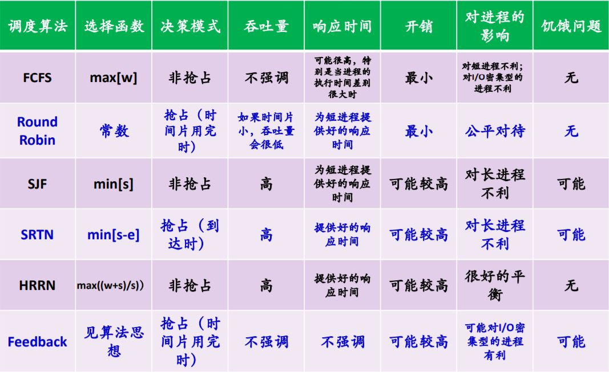   
• 多处理器调度算法：  
尽可能使进程总是在同一个CPU上执行，同时需要考虑负载均衡  

## 运行环境与运行机制  
• 寄存器分为用户可见寄存器和控制与状态寄存器  
用户寄存器：数据寄存器、地址寄存器、条件码寄存器  
状态寄存器：需要在特权模式下访问，包括：程序计数器PC、指令寄存器IR、程序状态字PSW(记录处理器的运行状态)  
• 操作系统有两种状态：用户态(目态)与内核态(管态)  
状态切换：
用户态→内核态，中断/异常/访管指令  
内核态→用户态，设置程序状态字PSW  
• 中断与异常  
中断处理过程：  
  
中断向量表：一个内存单元，存放中断处理程序入口地址和程序运行所需的处理机状态字，通过中断向量表将控制权给与中断处理程序  
中断响应过程：设备发出中断信号→硬件保存现场→根据中断码查表→把中断处理程序入口地址推送到相应的寄存器→执行中断处理程序  
时钟中断：系统维护多个软件始终，时钟中断的任务是维护并定时更新这些软件时钟  
硬件中断：Windows蓝屏时系统会进入故障处理程序，发现故障不可恢复时，进行内存转储，以用于日后诊断  
程序中断：程序指令出错、指令权限出错、指令寻址越界  
• IA32体系结构对中断的支持  
CPU分为实模式与保护模式  
实模式：使用中断向量表，中断处理与过程调用相似  
保护模式：中断描述符表IDT：采用门描述符描述中断向量  
处理过程：
确定与终端或异常相关的向量i→通过IDTR寄存器找到IDT表，获得中断描述符→从GDTR寄存器获得GDT(全局描述符表)地址，找到段选择符，
根据选择符找到段描述符，从描述符中得到中断处理程序的段基址→特权级检查(保证中断不会越级访问，确保CPL等级高于DPL)  
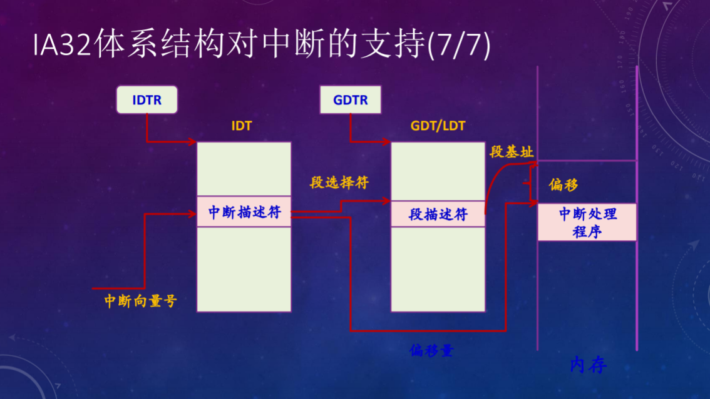  
• I/O访问技术包括：程序控制方式、中断驱动方式、DMA    
• 系统调用机制的设计：系统具有中断/异常机制→选择一条访管指令，引发异常，从用户态切换到内核态→通过系统调用号找到存放系统调用
的入口地址(常用的3种传参方法：通过陷入指令的参数、通过寄存器、通过内存传递)  

## 存储管理  
•用户程序经过编译、汇编后形成目标代码，目标代码通常采用相对地址的形式，其首地址为0，其余指令中的地址都相对于首地址而编址  
地址重定位就是将用户程序中的逻辑地址转换为物理地址，分为静态与动态重定位，动态重定位需要硬件MMU(内存管理单元)支持  
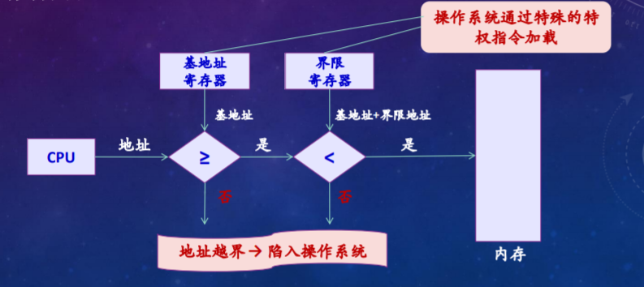  
•伙伴系统：将内存按2的幂进行划分，组成若干空闲块链表，一直将块大小除以2，直到其大小等于需要的大小  
•页表表项：页框号、有效位、访问位、修改位、保护位等  
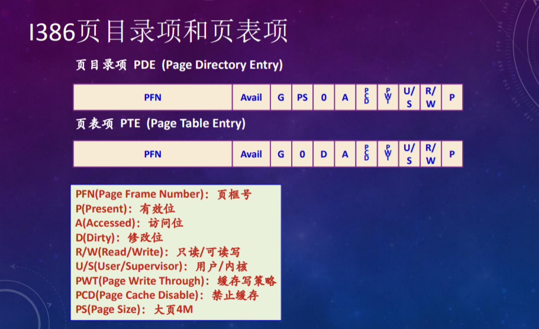  
缺页中断的处理流程：  
A、在内存中有空闲物理页面时，分配一物理页帧f，转第E步  
B、.依据页面置换算法选择将被替换的物理页帧f，对应逻辑页q  
C、如果q被修改过，则将其写入外村   
D、修改q的页表项中驻留位为0  
E、将需要访问的页p装入物理页面f  
F、修改p的页面驻留位为1  
G、重新执行产生缺页的指令  
•工作集：根据局部性原理，为程序的活跃页面分配页框，工作集的窗口长度越大，工作集就越大  
驻留集：当前时刻，进程实际驻留在内存当中的页框集合  
•各种页面置换算法总结：  
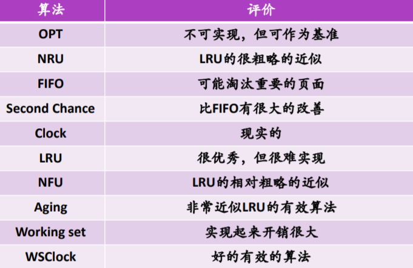  

## 同步机制  
•PeterSon算法关键：`while( turn == process &&interested[other] == TRUE); //当没轮到当前进程并且其他进程感兴趣的时候就循环`  
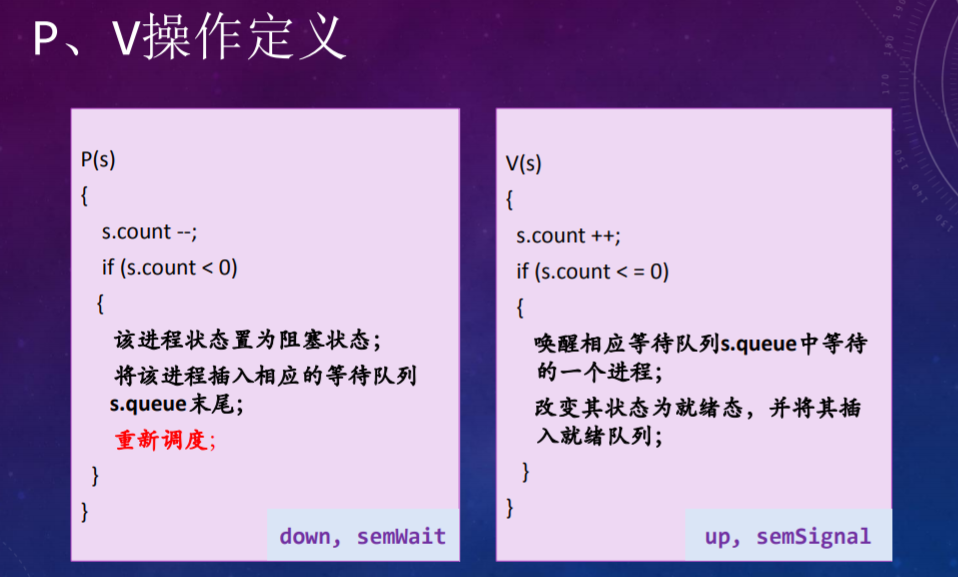  
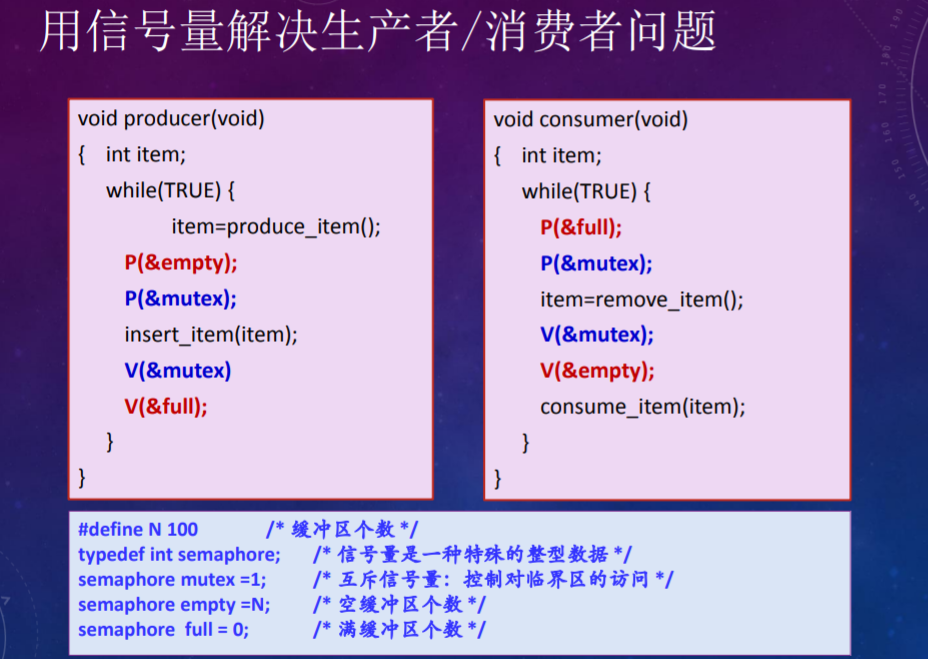  
PV都必须是原子性操作，并且此时P操作顺序不能颠倒，否则会发生死锁，V操作可以颠倒  
•进程与管程  
进程只能调用管程中的过程间接访问管程中的数据结构，管程是互斥进入的，同步的时候让一个进程或者线程在条件变量上等待  
如果有两个进程P、Q，当P在管程中执行唤醒Q的操作时：
Hoare管程：P等待Q执行  
MESA管程：Q等待P继续执行  
Hansen：规定唤醒为管程中最后一个可执行的操作  
  
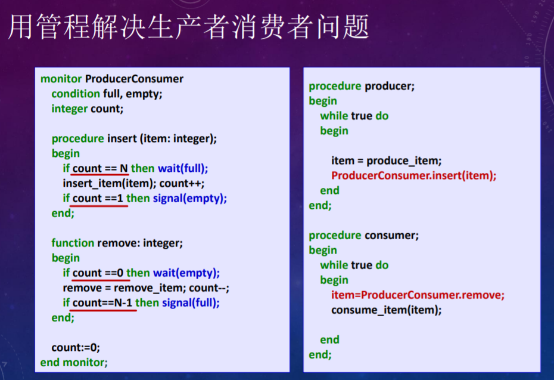  
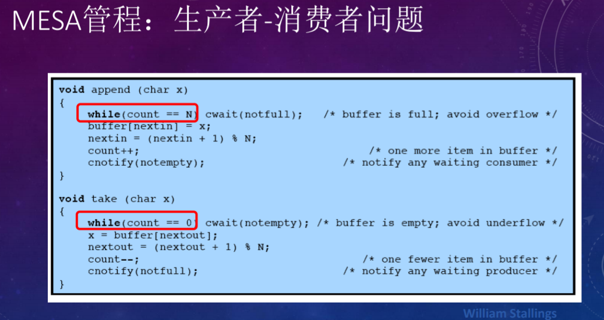  
•MESA管程  
BROADCAST原语可以使所有在该条件上等待的进程都进入就绪状态，假设insert和remove函数都适用于可变长度的字符块，
此时，如果一个生产者往缓冲区中添加了一批字符，它不需要知道每个正在等待的消费者准备消耗多少字符，而仅仅产生一个broadcast，
所有正在等待的进程都得到通知并再次尝试运行  
**HOARE管程与MESA管程的比较**  
Mesa管程优于Hoare管程之处在于应用Mesa管程时出错比较少
在Mesa管程中，由于每个过程 在收到信号后都检查管程变量，并且由于使用了while结构，一个进程不正确的广播或发信号，
不会导致收到信号的程序出错.收到信号的程序将检查相关的变量，如果期望的条件没有满足，它会重新继续等待  
•锁的实现  
进程等待在锁上的时候必须不停地开关中断，否则会导致中断永远被关闭  
锁可以用Test&Set指令实现，实现过程：复制锁到寄存器并将锁置为1，判断寄存器是否为0，如果不是0，就继续循环等待，否则返回调用者  
•通信机制  
通信机制适用于分布式系统、基于共享内存的多处理机系统、单处理机系统，可以解决进程间的同步问题、通信问题  
基本通信方式：消息传递、共享内存、管道、套接字、远程过程调用  
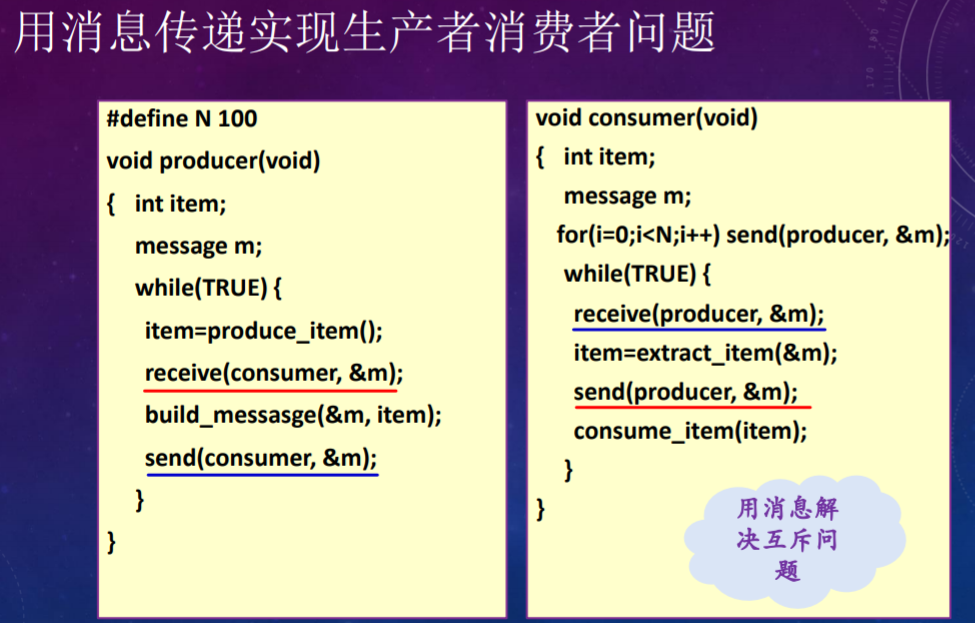  

## 死锁  
•产生死锁的必要条件：  
互斥使用(资源独占)：一个资源每次只能给一个进程使用  
占有且等待(请求和保持，部分分配)：一个进程在申请新的资源的同时保持对原有资源的占有  
不可抢占(不可剥夺)：资源申请者不能强行的从资源占有者手中夺取资源，资源只能由占有者自愿释放  
循环等待：存在一个进程等待队列 {P1, P2, … , Pn}，其中P1等待P2占有的资源，P2等待P3占有的资源，…，Pn等待P1占有的资源，形成一个等待环  
•死锁定理  
如果资源分配图中没有环路，则系统中没有死锁，如果图中存在环路则系统中可能存在死锁  
如果每个资源类中只包含一个资源实例，则环路是死锁存在的充分必要条件  
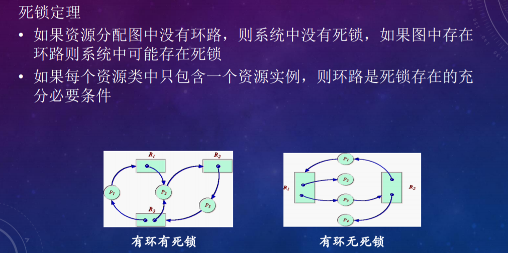  
•解决死锁  
**死锁预防**  
破坏“互斥使用/资源独占”条件：把独占资源变为共享资源，SPOOLing技术  
破坏“占有且等待”条件：要求每个进程在运行前必须一次性申请它所要求的所有资源，且仅当该进程所要资源均可满足时才给予一次性分配  
破坏“不可抢占”条件：近适用于状态易于保存和恢复的资源，如CPU、内存  
破坏“循环等待”条件：资源有序分配法，把系统中所有资源编号，进程在申请资源时必须严格按资源编号的递增次序进行，否则操作系统不予分配  
死锁避免：银行家算法  
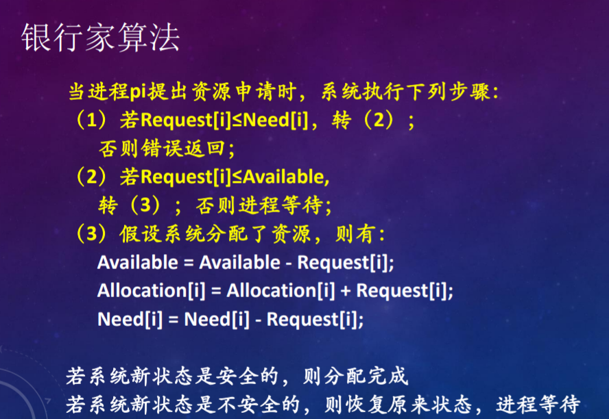  

## 需要注意的地方  
•程序调度算法的计算  
•页表的计算还需要重新整理  
•管程实现的PV完整代码
•死锁的资源分配图  

## 文件系统  
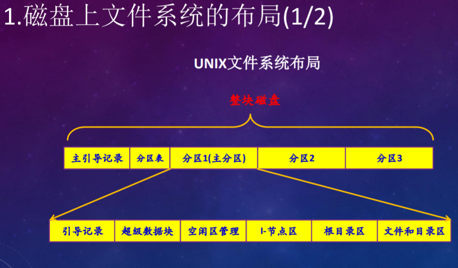  
文件的物理结构：连续结构、链接结构、索引结构  
   
文件目录改进，注意计算方法：  
   
•unix文件系统  
FCB = 目录项 + i节点  
目录项：文件名 + i节点号  
i节点：描述文件的相关信息  
每个文件由一个目录项、一个i节点和若干磁盘块构成  
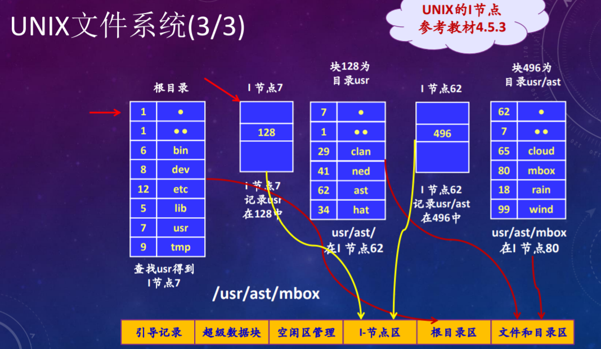   
  
磁盘空间管理：位图法、空闲块表、空闲链表法、成组链接法  
硬链接：多个文件名链接到同一个文件，其中一个用户删除文件时，仅仅删除对应的别名，不删除文件本身  
软链接：一种快捷方式，其内容是要共享的文件路径名，优点是可以链接到其他计算机上的文件  
文件系统写入方式：通写、延迟写、可恢复写  
提升文件系统性能的方法：FCB分解、当前目录、磁盘碎片整理、磁盘高速缓存、磁盘调度、提前读取(每次读取时多读几块)、RAID  
•NTFS  
NTFS提供了基于原子事务概念，每个属性由属性名和属性流组成，主控文件表MFT是NTFS重要的文件系统  

## 参考文章  
[1] [Linux scp命令](https://www.cnblogs.com/webnote/p/5877920.html)  
