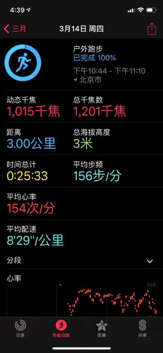
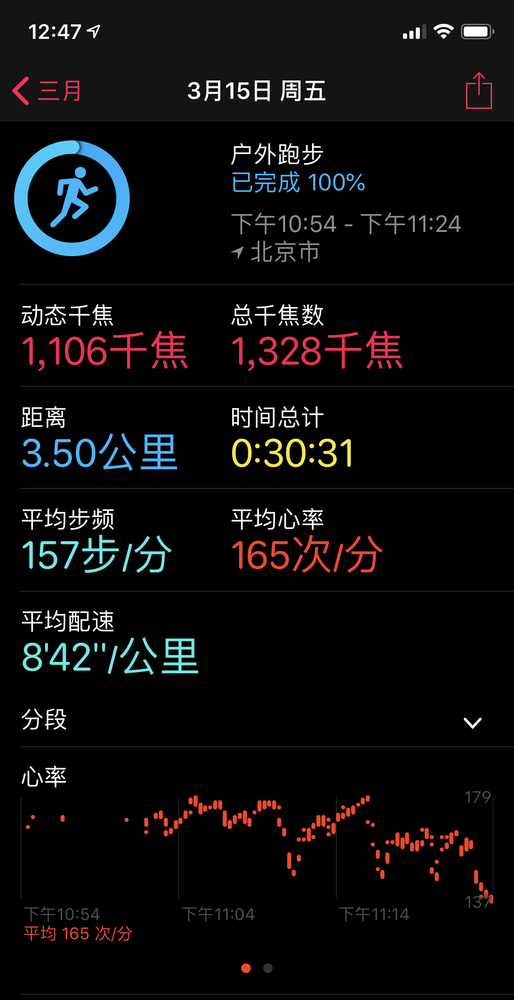
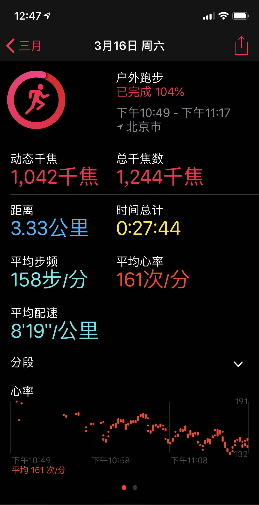
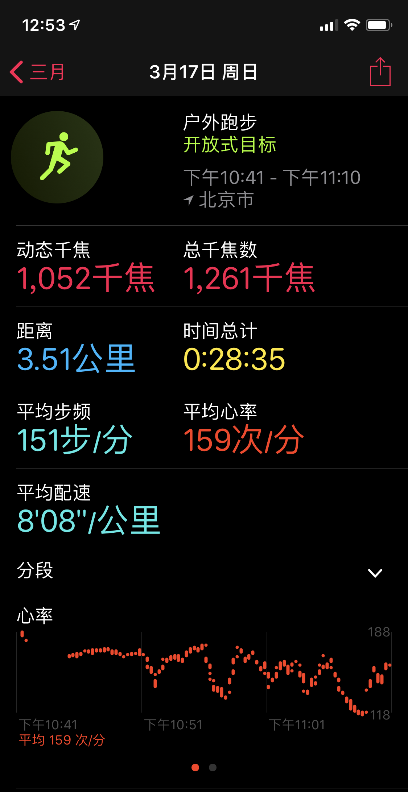

# 记录每天的运动情况

## 记录表

|日期|运动了吗|天气|运动状况|备注|
|:----:|:-----:|:----:|:----:|:----:|
|2019-3-13 |否|适合运动|xxx|偷懒|
|2019-3-14 |是|大风|校外跑步3KM||
|2019-3-15 |是|适合运动|校外跑步3.5KM||
|2019-3-16 |是|适合运动|校外跑步1042千焦||
|2019-3-17 |是|有风|校外跑步3.5KM||