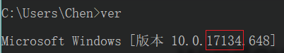
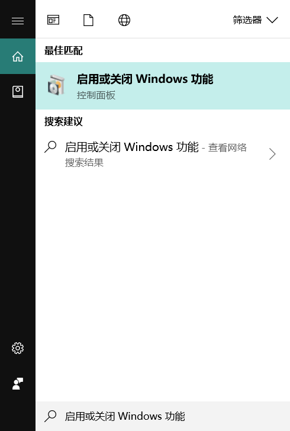
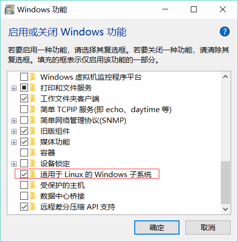
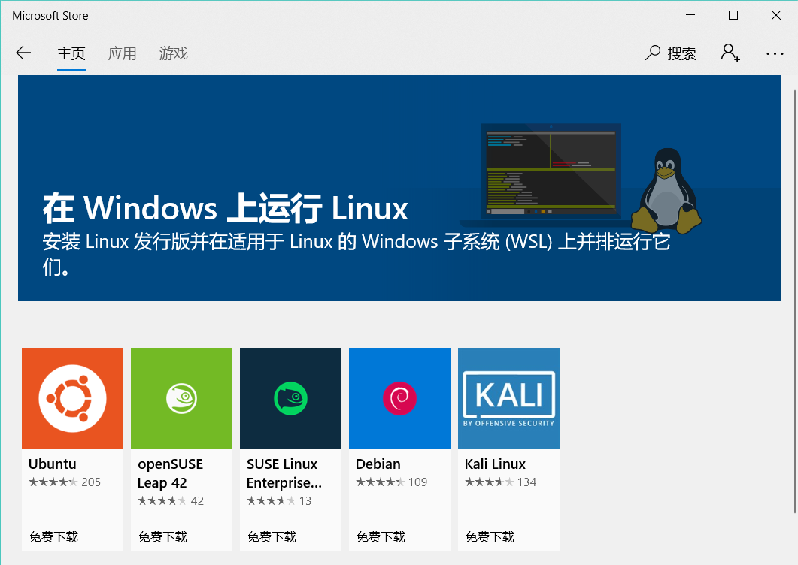
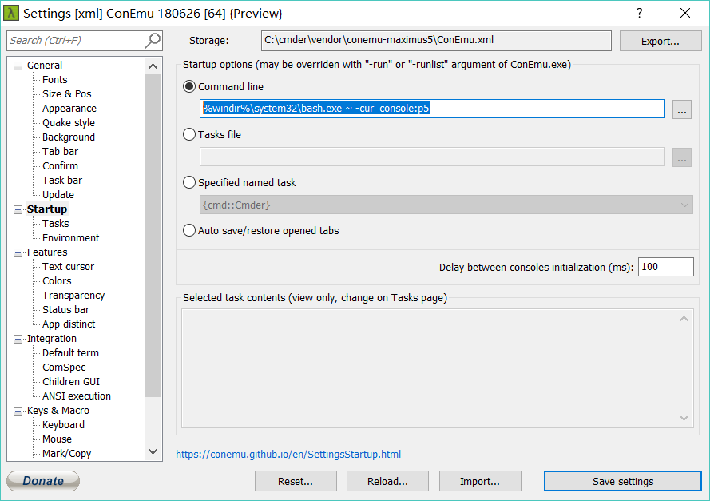

# Windows Linux子系统安装总结

---

## 为什么安装Linux子系统

+ **免费 免费 免费**

+ 省去了安装虚拟机的麻烦，同时也没有安装双系统的风险，安装方便

+ 卸载方便，就像卸载一个iPhone App一样简单

+ 这个Linux App与原生Linux一样，并且**可以直接访问Windows本地的文件系统**

+ 同时拥有Windows和Linux两个系统，没有虚拟机复制文件的烦恼，也省去了双系统切换的功夫，~~还能打游戏，做PPT~~ヽ（゜▽゜)ノ，完美解决了Linux所有弊端。

## 如何在Windows上启动Linux子系统

+ 请确认你安装的是Windows 10，并且版本在 build 16299以上

+ 如何查看版本？按   <i class="fab fa-windows"></i>+R，输入cmd进入命令行，输入ver即可  
  
+ 接下来按   <i class="fab fa-windows"></i>+S，在搜索框中输入“启用或关闭Windows功能”  
  
在下拉选项中找到适用于Linux的Windows子系统（可能需要重启）  
同时在适用于Linux的Windows子系统和Hyper-V打勾  
**注意，Hyper-V只有企业版/教育版/专业版Windows可用，同时，开启此选项是高危选项，如果发现任何问题，均可以取消勾选，Hyper-V只影响
docker安装等高级功能**  
  
然后在Microsoft Store中搜索Linux，点击安装即可：  
  
安装完成后，**需要打开界面，等待软件installing的提示结束**，就安装成功啦  <i class="fas fa-grin-wink"></i>

## 安装Oh-My-Zsh、cmder  
在上面的步骤中，如果没有遇到报错，那么就会有一个基本能够运行的Linux子系统，到此基本的配置已经结束，Linux系统已经可以使用了，
此节往后的内容是为了配置一个更友好的Bash界面,可以不用配置。   
+ 首先需要更换WSL(Windows Subsystem for Linux)的源为国内，[更换方法](https://blog.csdn.net/qq_35451572/article/details/79516563)  
+ 安装Oh-My-Zsh：  
```bash
sh -c "$(curl -fsSL https://raw.github.com/robbyrussell/oh-my-zsh/master/tools/install.sh)" 
```
禁止Oh-My-Zsh自动更新可以到~/.zshrc下找到DISABLE_AUTO_UPDATE一行，将行首的注释'#'去掉即可。  

+ 安装配置cmder：  
cmder是一个windows下一个好用的命令行软件[下载地址](https://cmder.net/)，点击Download Full，解压之后即可使用。  
配置cmder：在标题栏右键，选择Settings，然后选择Startup，在Comand line中输入如下：  
  
```bash
# 加上后缀-cur_console:p5是为了保证在vim下方向键可用
%windir%\system32\bash.exe ~ -cur_console:p5
```
在BackGround中可以修改背景图片，最后配置好的cmder如图：  
  
在General下，可以选择Interface Language为简体中文  
同时，需要在粘贴选项下，将粘贴模式Ctrl+V改为多行  
最后重启cmder即可。  

+ 配置zsh  
插件1：zsh-autosuggestions:  
一个自动提示过去使用过的命令的工具
```bash
git clone https://github.com/zsh-users/zsh-autosuggestions ~/.zsh/zsh-autosuggestions
vim ~/.zshrc
# 在.zshrc末尾添加： Load zsh-autosuggestions.
source ~/.zsh/zsh-autosuggestions/zsh-autosuggestions.zsh
```
## 报错记录

1. 当修改了Windows计算机名称时报了一个错误：WslRegisterDistribution failed with error: 0x800703fa  
解决方法：在运行窗口中执行“services.msc”指令，在本地服务中重启 LxssManager 服务 
 
2. 当想用脚本cd打开到工作目录的时候，出现了一直执行`sh start.sh`还是在原目录的情况  
这是因为Shell会fork一个子进程，然后子进程通过exec执行程序，所以每次执行完都会停留在原目录。  
如果要强制父bash执行呢？加入修饰符`source`或者`.`，即使用指令`. ./start.sh`或者`source start.sh`  

3. 想用docker run hello-world报错：  
docker: failed to register layer: Error processing tar file(exit status 1): invalid argument.  
原因是在docker上的这一个image不兼容NTFS文件系统，未找到解决方法

## 结语

微软是一个人民的好公司，不仅做出了在Windwos10里面塞一个完整的Linux子系统的骚操作，还收购了Github提供了私有仓库，
~~感谢微软爸爸~~。今天的遭遇再次印证了当初的那个想法，Windows其实比Mac更适合编程，
(~~Linus本人也夸过微软的姿势水平高~~)只是我等菜鸡还没有达到那个水平，把Mac高度集成的系统错认为了好用。

## ~~安装子系统的原因~~

> 今天和Ubuntu鏖战了一天。

> 早上发现Windows的PowerShell还是太难用了，无论装什么插件都拯救不了PowerShell，所以下午刚吃完饭就打起了装个Linux的主意。

+ 首先试了试Vmware，Vmware安装倒是挺方便的，但是在安装Vmware Tools的时候，软件已经提示我安装正确了，
但是关闭Terminal之后还是(~~屎~~)一样的分辨率，遂放弃。

+ 后来又打起了装个双系统的主意，装双系统其实还是挺简单的，但是Ubuntu总是默认会覆盖掉我的Windows Boot Manager，
而不会乖乖的呆在机械硬盘里，~~作为一个肥宅，没人能动我的Windows~~，遂把Ubuntu整个连根拔起，连Ubuntu的MBR都一起删了

+ 在打算放弃的时候，偶然间发现Windows可以运行Linux子系统，惊闻微软爸爸的操作，于是一顿谷歌加百度，
在MicroSoft Store中找到了Ubuntu 16.04，喜出望外，一顿安装，竟然能用，不仅能用，还挺好用，唯一出了一个问题就是网络连接老是出问题，
为了能联网更新apt-get安装软件，期间想了无数解决办法：
1. 尝试过更换阿里/清华/网易/中科大源，都不行
2. 还尝试过以上四者都写入source.list，最后会报一堆的 Ing:xxx
3. 还想过转换http和https、打开VPN等等的骚操作

+ ~~没想到最后是连上了室友的移动热点解决了问题，sspku的校园网还是太烂~~

## 参考文章  
[1] [WIN10下搭建一个linux环境(ubuntu+cmder+oh-my-zsh)](https://blog.csdn.net/lissettecarlr/article/details/81040750)  
[2] [Windows10终端优化方案：Ubuntu子系统+cmder+oh-my-zsh](https://zhuanlan.zhihu.com/p/34152045)  
[3] [Mac终端配置教程(重要)](https://wyydsb.xin/other/terminal.html)  
[4] [Windows PowerShell改造教程](https://zhuanlan.zhihu.com/p/56808199)  
[5] [cmder调用bash后方向键无法使用的问题](https://www.zhihu.com/question/57653031)  
[6] [Github速度慢的解决方法](https://blog.csdn.net/DlMmU/article/details/79562021)  
[7] [oh-my-zsh配置](https://www.jianshu.com/p/0f3dcec21a97)  
[8] [Windows Subsystem for Linux Overview](https://blogs.msdn.microsoft.com/wsl/2016/04/22/windows-subsystem-for-linux-overview/)  
[9] [Installing the Docker client on Windows Subsystem for Linux(关键文章，需要翻墙)](https://medium.com/@sebagomez/installing-the-docker-client-on-ubuntus-windows-subsystem-for-linux-612b392a44c4)  
[10] [docker问题：Problem running hello-world image(需要翻墙)](https://www.reddit.com/r/docker/comments/7vxhdu/problem_running_helloworld_image/)  
[11] [利用window10的Linux子系统实现docker的安装使用](https://www.jianshu.com/p/d1b2b4240256)  
[12] [docker docs官方文档](https://docs.docker.com/)  

