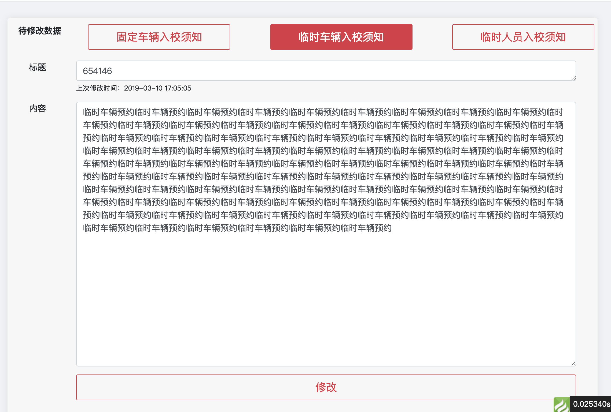

# HTML标签学习总结

---

## 什么是 HTML？


+ HTML 是用来描述网页的一种语言。
+ HTML 指的是超文本标记语言 (Hyper Text Markup Language)
+ HTML 不是一种编程语言，而是一种标记语言 (markup language)
+ 标记语言是一套标记标签 (markup tag)
+ HTML 使用标记标签来描述网页

## HTML 各标签的作用

>由于之前学过HTML，所以在这里只总结自己生疏的HTML标签

### 1.HTML的乱码问题：

由于HTML页面的汉字经常乱码，一般会在`<head>`标签内加入：`<meta http-equiv="Content-Type" content="text/html; charset=utf-8" />`

### 2.HTML的表格：

`<table>`标签定义表格，一般可以用例如border="1"指定边框宽度为1。每个表格均有若干行（由` <tr>` 标签定义），每行被分割为若干单元格（由 `<td>` 标签定义）。字母 td 指表格数据（table data），即数据单元格的内容。表格的表头使用` <th>` 标签进行定义。数据单元格可以包含文本、图片、列表、段落、表单、水平线、表格等等。
+ 举例，代码：
```
<table border="1">
<tr>
<th>内容1</th>
<th>内容2</th>
</tr>
<tr>
<td>row 1, cell 1</td>
<td>row 1, cell 2</td>
</tr>
<tr>
<td>row 2, cell 1</td>
<td>row 2, cell 2</td>
</tr>
</table>
```
> 显示效果为：
<table border="1">
<tr>
<th>内容1</th>
<th>内容2</th>
</tr>
<tr>
<td>row 1, cell 1</td>
<td>row 1, cell 2</td>
</tr>
<tr>
<td>row 2, cell 1</td>
<td>row 2, cell 2</td>
</tr>
</table>

### 3. HTML内置框架iframe，可以用于在网页内展示网页

+ 代码：
```
<iframe src="http://101.200.53.152/posts/conclusion_HTML.html" frameborder="0"></iframe>
```
> 显示效果为：
<iframe src="http://101.200.53.152/posts/conclusion_HTML.html" frameborder="0" width="800" height="400"></iframe>

### 4. `<del>`标签可以用于删除文本，特定场合比较有用，如；

```
<del>PHP是世界上最辣鸡的语言</del>
```
~~PHP是世界上最辣鸡的语言~~

### 5. HTML5的音频与视频播放器：

> 今天，大多数音频是通过插件（比如 Flash）来播放的。然而，并非所有浏览器都拥有同样的插件。

> HTML5 规定了一种通过 audio 元素来包含音频的标准方法。

> audio 元素能够播放声音文件或者音频流。

> 今天，大多数视频是通过插件（比如 Flash）来显示的。然而，并非所有浏览器都拥有同样的插件。

> HTML5 规定了一种通过 video 元素来包含视频的标准方法。
```
HTML音频插件使用方法如下：
<audio src="http://www.w3school.com.cn/i/song.ogg" controls="controls">
Your browser does not support the audio element.
</audio>
```
> 效果如下：
<audio src="http://www.w3school.com.cn/i/song.ogg" controls="controls">
Your browser does not support the audio element.
</audio>

```
HTML视频插件使用方法用法如下：
<video src="http://www.w3school.com.cn/i/movie.ogg"  width="320" height="240" controls="controls">
Your browser does not support the video tag.
</video>
```
> 效果如下：
<video src="http://www.w3school.com.cn/i/movie.ogg"  width="320" height="240" controls="controls">
Your browser does not support the video tag.
</video>

## HTML实现点击按钮切换页面

实现效果如下：


代码如下：

[代码链接](https://github.com/RobinChen95/Backup-ThinkPHP/blob/master/application/manager/view/plugin_content/index.html)

实现解析：使用JS判断，将不需要显示的`<div>`的`style`设置为`display:none`，从而实现只显示一个页面
```
未完待续
这篇文档是现学vuepress主题vuepress-theme-ktquez
https://github.com/ktquez/vuepress-theme-ktquez
和markdown文法写的
以后有时间会完善
感谢ktquez提供主题
```

## HTML的DOM事件对象总结

`<input onclick = "send_form()"/>`

[文章链接](http://www.runoob.com/jsref/dom-obj-event.html)

---

鼠标键盘事件

---
|函数|功能|
|:----:|:----:|
|onclick|当用户点击之后触发|
|ondblclick|当用户双击之后触发|
|onmouseenter|当鼠标移动到某元素上时触发|
|onmouseover|当鼠标移动到某元素之上触发 *有些许区别|
|onkeydown|某个键被按下|

---

框架与对象事件

---
|函数|功能|
|:----:|:----:|
|onbeforeunload|当用户在即将离开页面时触发|
|onload|当图像或页面完成加载时触发|
|onpageshow|当用户访问页面时触发|
|onpagehide|该事件在用户离开当前网页跳转到另外一个页面时触发|
|onsroll|文档被滚动时触发的事件|
|onunload| 当用户退出页面

---

表单事件

---

|函数|功能|
|:----:|:----:|
|onblur|当元素失去焦点时触发|
|onfocus|当元素获得焦点时触发|
|onchange|当元素内容改变并且失去焦点时触发|
|oninput|当元素获得用户输入时触发|
|onselect|当用户选取文本时触发|
|onsubmit|当表单提交时触发|

---

剪贴板与打印事件

---

|函数|功能|
|:----:|:----:|
|oncopy|当用户拷贝时触发|
|oncut|当用户剪切时触发|
|onpaste|当用户粘贴时触发|
|onafterprint|当页面已经开始打印或者打印完成时触发|
|onbeforeprint|当页面即将打印时触发|
