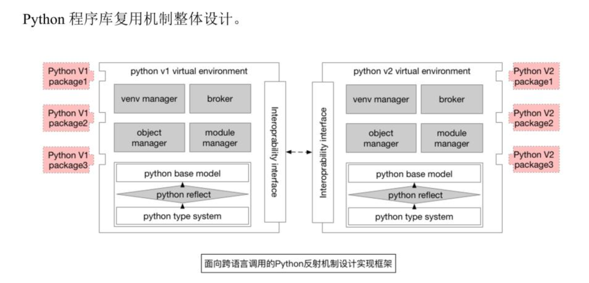

## 研三上工作汇报  

---  
### 第一次工作汇报  2020/11/05  
---  

#### 本周工作内容  

本周的主要工作：
+ **1.阅读论文，总结出设计的模式**  
    + 总体的设计目标：使智能合约能够支持数据分析第三方库的运行    
        + ~~1）最简单的设计：仅为其构建通信机制~~  
            + AI程序与python后台运行在一个容器中，yjs代码运行在另一个容器中  
            + 他们分别都是可用的，然后为他们构建一个通信环境，包括参数传递、图片传输  
            + 在yjs的java代码中写一个通信模块即可
            + 缺点是每一次需求的改变，两边的代码都需要进行改变  
            ```js
            // 例如这样的构造，只需要写一个
            {"data":"{\"yjsJsonRpc\":\"0.1\",\"yjsMethod\":\"POST\",\"yjsParams\":{\"package_name\":\"sys\",\"module_name\":\"sys\",\"module_class_name\":\"__loader__\",\"params\":{\"arg1\":\"object_id\"}},\"yjsRequestId\":\"123456\" }"}
            ``` 
        + 2）进一步的设计：  
            + 将yjs到来的请求生成一个python类的实例，运行在内存中，需要调用的时候凭借object ID调用  
            + 此时python语言端将成为一个反射库，会根据传入配置参数的不同，生成不同的对象实例，运行在内存中  
            + 此方法的好处在于：
                + 在java端利用反射机制，只需要改变传入的参数即可调用不同的python对象  
                + 对不同程序的复用方便，不需要每一次都去设计接口  
            + 此方法的难点在于：
                + 需要实现对象管理（已实现）、环境管理  
                + 每一次传入的时候都会实例化对象，那么就需要在内存中做好内存清理
                
        + 3）支持AI还需要的步骤：
            + 提供第三方库的引入与管理机制，需要根据py代码传入的python import库进行对应的下载与管理  
            + 提供AI模型的加载与管理机制
            + 提供不同yjs文件的互操作机制
            + 最后的完成结果应如下：
            ```js
              contract
              AppDataContract{
                  export function createObject(args) {
                      // 以下是内嵌的python语言
                      var python="
                        # coding=utf-8
                        import os
                        import sys
                        import MySQLdb
                        import json
                        sys.path.append("/root/env")
                        import app_wx
                        from flask import Flask, request
                        from werkzeug import secure_filename   # 获取上传文件的文件名
                        app = Flask(__name__)
                        model_cv = app_wx.Application("./models")
                        db = MySQLdb.connect("localhost", "root", "123456", "age", charset='utf8')
                        cursor = db.cursor()
                        # 原生人脸属性检测url使用robinchen95.com/upload
                        @app.route('/upload', methods=['GET','POST'])
                        def upload_img():
                            if request.method == 'GET':   # 如果是 GET 请求方式
                                return "robinchen95.com/upload浏览器访问！来自python2.7"
                            if request.method == 'POST':   # 如果是 POST 请求方式
                                file = request.files['file']   # 获取上传的文件
                            if file:
                                filename = secure_filename(file.filename)   # 获取上传文件的文件名
                                img_path = os.path.join('/img', '{}'.format(filename))
                                file.save(img_path)
                                pre_result=model_cv.predict(img_path)
                                return pre_result   # 返回保存成功的信息
                            return "failed"
                      ";
                      // 或者这样调用
                      var python = "./test.py"
                      var req = {"url":"http://127.0.0.1:5000/api/createObj/","python":python};
                      print("req:" + JSON.stringify(req));
                      res = YancloudUtil.httpPost(JSON.stringify(req));
                      obj = res.obj;
                  }
              }
            ```

+ **2.运行、修改、拆分之前孟亮的代码**  
    + 之前的设计逻辑：
        + 存在的问题：
            + 没有在代码中实现python反射
            + python端对象管理、模块管理、环境管理不够完善，无法运行
            + java端中仅仅实现了定义，并没有实现
        

+ **3.工作计划**

|日期|完成内容|
|:----:|:----:|
|2020/11/30|完成python端的反射库逻辑，能够使用https请求生成不包含第三方库的python对象|
|2020/12/30|完成python端的第三方库对象的生成逻辑，提供自动补全的pip install机制|
|2021/01/30|完成yjs文件的互操作逻辑，完成AI模型的加载与管理逻辑|
|2021/02/30|完成初步的系统调试与测试|
